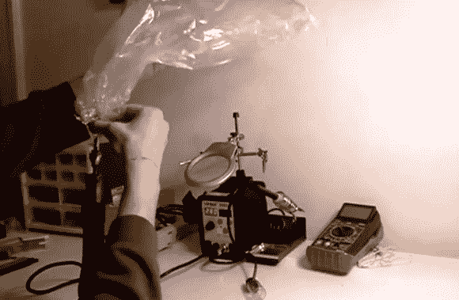

# 热风返工兼作草药袋蒸发器

> 原文：<https://hackaday.com/2013/01/24/hot-air-rework-doubles-as-an-herbal-bag-vaporizer/>

这个热空气返工站不仅仅用于焊接表面贴装元件。因为它有温度和气流的设置[brokehiptech][认为它可以作为一个袋式蒸发器](http://www.youtube.com/watch?v=KJu5bSXa-2s)工作。在休息后的视频中，他们展示了定制的部分，然后把它和草药混合袋填充。

热空气站有几个不同的提示。最小的一个用于安装蒸发器碗使用高温 JB 焊接。在碗的输出侧，金属杆也固定在与蒸发器袋的接口上。来自返工站的热量将草药带到燃烧点以下，释放活性成分，不包括与吸烟相关的有害副产品。

我们把这个放在医学黑客之下，因为我们希望它被负责任和合法地使用。就像我们在看到的最后一个汽化器一样，我们担心这个装置还会向收集的气体中加入什么。

[https://www.youtube.com/embed/KJu5bSXa-2s?version=3&rel=1&showsearch=0&showinfo=1&iv_load_policy=1&fs=1&hl=en-US&autohide=2&wmode=transparent](https://www.youtube.com/embed/KJu5bSXa-2s?version=3&rel=1&showsearch=0&showinfo=1&iv_load_policy=1&fs=1&hl=en-US&autohide=2&wmode=transparent)

[谢谢乔尔]