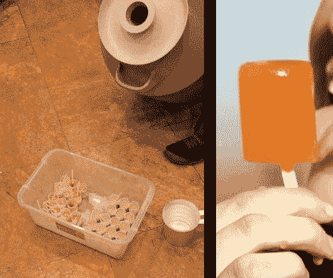

# 够热吗？超冷鸡尾酒会有帮助

> 原文：<https://hackaday.com/2012/06/21/hot-enough-for-ya-super-cold-cocktail-pops-will-help/>

Instructables 的员工知道如何在这个已经太热的夏天放松和降温。他们正在用鸡尾酒制作自己的冰棍。如果每个人都足够幸运，在工作中有支持这类项目的雇主就好了。

所以这里的问题是酒的冰点。你的玛格丽塔酒、代基里酒、草莓加香槟、俄罗斯白葡萄酒和其他喜欢的酒不会在普通的冰箱里凝固，因为零华氏度根本不会凝固。因此，大枪带来了负担。鸡尾酒被排列在一个容器里，用液氮浸泡。

这种物质在华氏零下 321 度左右沸腾，这一温度足以迅速冷冻这些酒精饮料。但是要小心。它们被冷冻后，你需要把它们扔进冷冻室**。第一批豚鼠在试图过早地舔汽水时烧伤了他们的舌头。**

 **不想买你的液氮？为什么不[自己做](http://hackaday.com/2010/06/10/making-liquid-nitrogen-at-home/)？**