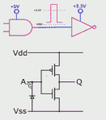
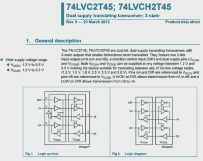
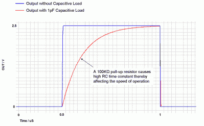
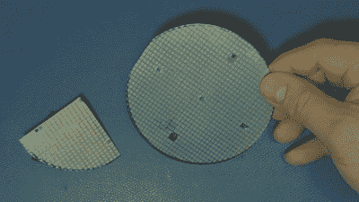
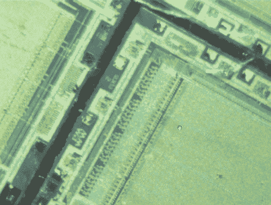
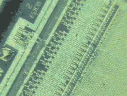
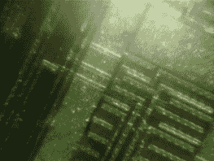
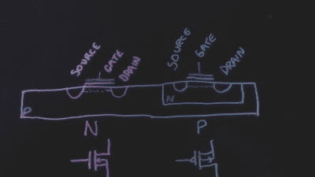
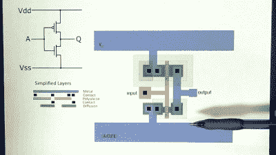
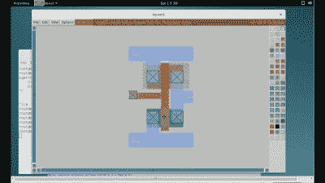

# CMOS 如何工作:关于 CMOS 的一些最后的话

> 原文：<https://hackaday.com/2015/09/02/how-cmos-works-some-final-words-about-cmos/>

在结束 CMOS 总线逻辑的话题时，我将展示几个具有独特属性的系列，它们可能有一天会派上用场。

[https://www.youtube.com/embed/gtvmhRof3ww?version=3&rel=1&showsearch=0&showinfo=1&iv_load_policy=1&fs=1&hl=en-US&autohide=2&wmode=transparent](https://www.youtube.com/embed/gtvmhRof3ww?version=3&rel=1&showsearch=0&showinfo=1&iv_load_policy=1&fs=1&hl=en-US&autohide=2&wmode=transparent)

## 耐高压家族:AHC/AHCT

Note the missing diode to VDD

首先是 CMOS 逻辑系列 AHC/AHCT，其输入端的一个保护二极管被移除。这允许将 5V 输入电压施加于由 3.3V 供电的器件，这样我就不必仅仅为了转换而增加一个门。任何时候我都可以翻译，并且没有任何额外的门延迟，我是一个快乐的工程师。

当然，上面的例子是单向的，双向的开始变得更加复杂。如果存在方向控制信号，使用双向缓冲器(如 74AHCT245)将有助于从 3.3V 回到 5V 的 TTL 转换。

## 双电压转换收发器

 通过真电压转换的另一个逻辑系列是双电源转换收发器，例如 74LVC2T245。该器件可以将 1.2-5.5V 之间的任何电压转换为同一范围内的任何其他电压，因此适用于 2V 以下至 TTL 以及其他组合的电压。这种类型的设备实际上使用两个电源引脚，每个引脚对应一个被转换的电压。

74LVC2T245 包括一个“总线保持”功能，该功能也可以在其他逻辑系列中找到，这些逻辑系列的名称中有一个表示总线保持的“H”。

## 总线保持功能

对总线保持功能的需求源于我们使用大量上拉电阻的同样考虑；每一个信号对应一个信号，该信号在任何时间长度内具有高阻抗三态的时刻或可能性，即在没有任何可能的总线驱动器开启的三态时刻期间。这是一种“浮动”状态，电压可以自由漂移，不幸的是，它可能会漂移到既不是逻辑高也不是逻辑低的未指定逻辑电平状态。在这一点上，不好的事情发生了，电流消耗上升了(还记得我们在上一篇文章中谈到 VCC 和地之间的两个晶体管同时导通吗？)实际上，事物可能会振荡，事实上，您甚至无法用示波器看到振荡，因为振荡可能发生在连接到总线的芯片内部。

Source: [EE-Times]

弱上拉，即上拉电阻，可以添加到所有信号中，这样任何悬空的信号最终都会被拉至高电平状态。然而，一般来说，上拉有几个问题；它们增加了电流消耗和总线上的负载，并且它们可能需要相对较长的时间来将电压拉高到“安全”高逻辑区。相对较长的时间是指 20-50 纳秒或更长时间，因为总线上不可避免的电容会导致无源电阻出现 RC 衰减。

通过“提升”低电压信号并使缓冲器在驱动低电压信号时更努力地工作，使上拉变得更强(即，更小的值)可能具有更急剧地增加功耗和降低噪声容限的不期望的效果。

## 集成电路芯片和管芯

切换齿轮我要谈一谈集成电路的物理布局。这里展示的是一张我 20 世纪 80 年代在 Commodore 工作时留下的旧晶片。在我工作台上的显微镜下，你可以看到晶片上的单个芯片。在生产中，在适当的测试和质量保证步骤之后，这些将被划线和切割，使得各个管芯可以被安装在各个芯片封装中。

如果我们进一步放大，我们可以看到芯片上的一些内容。请注意，我们看到的是一层半透明的绝缘层，称为钝化层。曾经，芯片设计者可以要求几个晶片/芯片跳过钝化步骤，以便稍后他们可以在显微镜下更好地观察和探测芯片，尽管当芯片暴露在没有保护性钝化涂层的空气中时，芯片的寿命是以月来测量的。

      

## FET 侧视图

显示了如何制造场效应晶体管(FET)的侧视图，该工艺从铺设绝缘层开始，然后掩蔽一层多晶硅，这是一种用于栅极接触的相当导电的材料。需要注意的是，栅极将与其下方的所有器件保持绝缘，尽管可能会有触点向上连接到金属导体，并最终连接到 IC 的焊盘和引脚。在图中可以看到栅极下面的绝缘层。

一旦放下栅极，通过将材料暴露于离子注入机来“注入”将成为晶体管的末端。在 Commodore 时代，我们总是破坏我们的注入机，因为我们运行的离子密度高于注入机的设计密度。这一层被称为扩散层，追溯到该层通过化学掺杂扩散的时代。

靠近多晶硅栅极的两个扩散区现在被称为源极和漏极，这是晶体管工作所需的:向栅极施加正确的电压，在栅极和源极之间的栅极下形成导电沟道(如上面的虚线所示)。与双极晶体管不同，双极晶体管意味着它有一个 P 层和一个 N 层，而 P 层和 N 层构成了二极管(仅单向导通)，FET 支持两个方向的电流，因为器件是对称的，漏极和源极由相同的材料制成，其间有衬底。

[![[Source: Wikipedia]](img/29de074b6c9e5c66b24c7de29622f2ac.png)](https://hackaday.com/wp-content/uploads/2015/09/cmos-side-view.png)

[Source: Wikipedia]

说到衬底或万物生长的基础层，它不是 N 型就是 P 型。现在最常见的是 P 型衬底，它允许 N 沟道器件直接在上面生长，就像 CMOS 的前身 NMOS 技术公司所做的那样。在我们能够制造 P 沟道晶体管之前，我们必须首先制造一个微型的 N 衬底，它完全包含了 P 沟道器件所在的区域。查看该图，您将看到 N 阱，其作用类似于 N 衬底。当 CMOS 第一次出现时，我记得读过关于使用“双槽”或同时使用 P 阱和 N 阱与仅使用 P 衬底的利弊，但我相信“单槽”或单阱会胜出，尽管可能会有更多的寄生因素，而不是将所有东西都放在一个阱中的隔离属性(也占用更多空间！)

现在对于 P 沟道器件，一旦实现了 N 阱，相同的步骤基本上是相同的。当注入时，使用不同于用于 N 扩散的掺杂剂来注入 P 扩散漏极和源极。掺杂剂的例子是用于 P+扩散的硼和用于 N+扩散的砷。

## 俯视图

从上面往下看，东西看起来像一堆重叠的多边形，主要是因为它们实际上是一堆重叠的多边形。我认识的大部分芯片布局的人都提到过，在某个时刻，他们在睡梦中梦到过多边形。

如果我们寻找多晶硅以及它看起来与扩散重叠的地方，尽管我们知道它并没有像我们在侧视图中看到的那样真正重叠，但我们可以发现晶体管。当谈到尺寸时，多晶硅栅极下面的沟道长度是我们得到“设计规则”的地方，例如，说某物使用 90 纳米规则意味着源极和漏极之间的有效沟道长度是 90 纳米长。

在视频中，我将简单 CMOS 反相器的布局与原理图进行了对比。

## 开源“魔法”VLSI 编辑器

Open source Magic VLSI editor.

最后，我想展示一个开源编辑工具，它允许我们自己玩一些芯片布局。该计划被称为魔术及其历史和[下载可以在这里找到](http://opencircuitdesign.com/magic/)。

这是一个很好的学习工具，内置于软件中的设计规则检查(DRC)可以帮助初次接触该工艺的人理解间隙和其他关于布局和生产的规则。该软件起初可能很难使用:必须左键单击一个网格，然后右键单击所需多边形的对角，然后通过在工具栏上的层上单击鼠标中键来选择层。可以加载不同的规则，包括可扩展的特征以及如何使用各种工艺制造电阻器或电容器。在幕后，DRC 开始发挥作用，可以提取各种层、掩模和其他光刻数据，开始芯片制造过程。

## 但是为什么呢？

我的工程风格总是藏在幕后，我很幸运在几个地方工作，那里有非常聪明的人向我解释我看到了什么或想知道什么。例如，了解 ESD 保护是如何实现的，可以帮助工程师理解在各种不同寻常的情况下，什么是好的设计，什么不是，因为数据手册本身并不能说明一切。