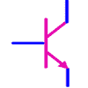
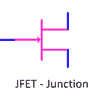
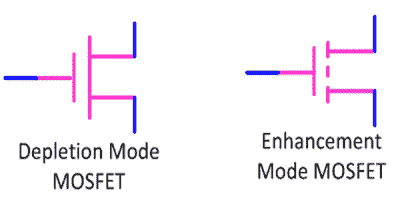
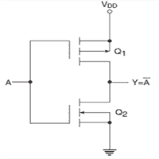
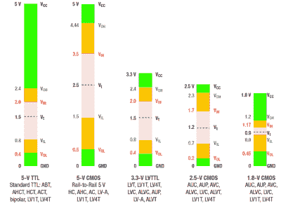
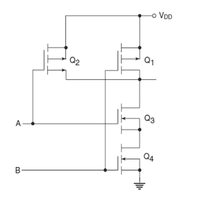

# CMOS 工作原理:MOSFETs、JFETs、IGFETS 等

> 原文：<https://hackaday.com/2015/08/03/how-cmos-works/>

CMOS 为当今高度集成电路和低功耗便携式和移动设备所需的许多(如果不是大部分)特性打开了大门。在 CMOS 的速度和电流驱动能力赶上其他技术之前，这是不可能发生的，但他们确实赶上了。

如今，CMOS 小规模集成(SSI)逻辑系列，即外部逻辑中使用的门，提供非常快的速度和高电流驱动能力，并支持现代设计中的低电压。同样，由于低功耗和其他因素，超大规模集成电路(VLSI)设计或非常大规模集成电路(如果你喜欢在说话时数字母 V)也是可能的。

[https://www.youtube.com/embed/LAHEjnYDxvM?version=3&rel=1&showsearch=0&showinfo=1&iv_load_policy=1&fs=1&hl=en-US&autohide=2&wmode=transparent](https://www.youtube.com/embed/LAHEjnYDxvM?version=3&rel=1&showsearch=0&showinfo=1&iv_load_policy=1&fs=1&hl=en-US&autohide=2&wmode=transparent)

## CMOS 是如何设计的

CMOS，意思是互补金属氧化物半导体，是基于结合 MOSFETS 的两种极性；金属氧化物半导体场效应晶体管。

 常规晶体管被称为双极结型晶体管(BJT ),这意味着它们由具有正和负(PN)结的结制成，利用电流作为输入，并通过控制输出电流来产生增益。当所有这些电流累积起来时，这意味着在一天结束时，有大量电流流动，导致功率耗散，最终导致热量。

 结型场效应晶体管(JFET)在其栅极输入端利用电压而不是电流，有点像双极晶体管的基极，来控制输出电压。由于栅极与其他端子(即源极和漏极)不绝缘，因此 JFETs 中存在漏电流，如果栅极与源极和漏极绝缘，则不会存在漏电流。
绝缘栅场效应晶体管(IGFET)是当今大规模集成芯片上大多数晶体管器件的基础。从图中可以看出，所有 MOSFETs 在栅极和结构的其余部分之间都有明显的间隔。另外两个引脚是源极和漏极。

  这是 MOSFET 中的“氧化物”二氧化硅造成的真实间隙。如果这听起来像玻璃，一种非常好的绝缘体，我会说是的。如果一个好的绝缘体听起来像电介质，是电容器的原料，我也会说是的。FET 有两种主要模式，根据极性有两种不同的类型。主要模式是增强和耗尽。

增强型 MOSFET 需要向栅极施加电压以使器件导通，与需要施加栅极电压以关断的耗尽型器件相反，它可以被视为常闭开关，也可以被视为常开开关。

FET 有两种不同的极性，部分取决于栅极信号的极性及其对器件的影响:当对栅极施加相对于源极的正电压时，N 沟道器件被激活，P 沟道器件被负电压激活。

  MOSFET Inverter  Alternate symbols for MOSFETs

通过组合 N 沟道器件和 P 沟道 MOSFETs，实现了反相器。当栅极为高电平时，N 沟道 MOSFET 导通，将输出拉低。同样，当栅极为低电平时，P 沟道 MOSFET 导通，将输出拉高。请注意，另一种绘制右侧 MOSFETs 的方法更为直观，因为 P 沟道上的气泡表示栅极上的低电平将开启它。

## 未受保护的 CMOS 可能很脆弱

 输入端的高阻抗，即缺乏对地的负载电阻，意味着人体手指等物体上的一点点静电荷，实际上对于无保护的 CMOS 电路来说可能是灾难性的。一个简单的火花或其他不可见的电荷可以通过在栅极绝缘中打孔来毁坏基于 MOS 的器件。过压引起的另一个问题是所谓的“SCR 闭锁”，基本上，过压会导致布局产生的 PNPN 结充当背对背晶体管，级联进入完全导通状态，导致电源轨之间短路。缓解短路状况的唯一方法是切断器件电源，从而关闭所有通电的晶体管。如图所示，增加保护二极管是非常标准的做法，尽管有时二极管功能实际上是通过片上 JFETs 实现的。

先说 CMOS 逻辑家族。下表显示了最新系列和过时之间的曲线。视频中关于 TTL 属性的许多评论提到，TTL 在很大程度上是“成熟的”、旧的和/或过时的。虽然这通常是正确的，但 TTL 逻辑电平的遗产以 TTL 兼容系列的形式存在，通常在系列名称中用“T”表示。

## CMOS 与 TTL 的关系

基于 CMOS 的逻辑的电压电平与 TTL 略有不同，基本上不是预设的低电平(. 4-.8v)和高电平(2-2.4v)，CMOS 的输入逻辑电平大多表示为电源电压的比率。

输出电压通常在各供电轨的十分之几伏范围内，输入阈值通常分别为低和高电源电压的 1/3 和 2/3。这具有最大化噪声容限的效果，因为近轨到轨输出摆幅(从近地到近电源)确保栅极具有最大输出电压摆幅。

必须注意的是，当栅极完全打开或完全关闭时，CMOS 工作最佳，功耗最低，电压必须保持在表中粉色区域之外，这一点非常重要。

CMOS 输出通常可以连接到 TTL 输入，前提是 CMOS 输出可以提供足够的电流。从 TTL 输出馈入 CMOS 输入有点麻烦，因为 5v 系统中 2.4V 的 TTL 输出不足以保证 CMOS 器件看到高电平。一般来说，上拉电阻可以提供最后一点点电压，但更干净的方法是使用“T”型 CMOS 器件，如用 HCT 代替 HC，或用 AHCT 代替 AHC。

## 低压高速

下图显示了 CMOS 多年来随着速度的提高和最终对更低电压的支持而取得的进步；如图所示低至 0.8V。技术趋势的结果是，在右上角的是较老的家庭，左下角的是更新更先进的家庭。在此期间，其他属性也有所改善，包括 24-60ma 驱动电流的输出电流变得常见。低电压和高速度往往携手并进，因为电压压摆的“距离”更短。随着新的电压而来的是其他一些问题，比如它们之间的转换，我将在下一篇文章中稍微介绍一下。

CMOS Family Voltage Vs Speed. Source:TI CMOS Brief

## 下次

在下一个视频中，我将展示 CMOS 逻辑系列的一些功能，包括电源电压转换，例如 3.3v 至 5v，还包括低至 0.8v 的总线“保持”功能，并尝试展示如何布局 CMOS 栅极，以及 CMOS 制造中使用的各种层和技术。

对于本周的测验，下图描述了什么逻辑函数:

