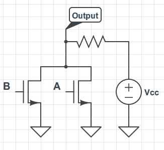

# 计算机如何工作，从晶体管门开始

> 原文：<https://hackaday.com/2012/11/01/how-computers-work-starting-with-transistor-gates/>

[Andrew Gibiansky]刚刚开始了一个叫做晶体管计算的系列教程。它的目的是拉回高级语言和电子控制之间的许多隐藏层。第一篇文章从解释电压源、负载和电流开始。但是不要被它的简单所迷惑。[Andrew]很快继续谈论开关晶体管，以及它们如何被用来建造像上面看到的~~或~~或非门这样的门。

如果这是最有趣的一点，你也应该回头看看关于 Nand 2 俄罗斯方块的帖子。这是一门在线课程，通过*计算系统的要素*教科书来学习。我们自己也一直在跟随这一旅程，在大约一周的时间里完成了硬件构建。汇编程序花了差不多同样多的时间，现在我们正在调试地狱，试图得到最后一个函数调用，并返回部分 VM 翻译器正常工作。我们以前使用过这个旅程中需要的大部分技能，但从来没有在一个项目中使用过。它确实揭示了我们知识上的差距，同时我们也获得了很多乐趣！

[via [Reddit](http://www.reddit.com/r/electronics/comments/12d3y7/computing_with_transistors/)