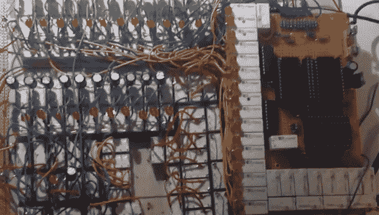

# 如何构建一个中继 CPU？

> 原文：<https://hackaday.com/2013/10/13/how-do-you-build-a-relay-cpu/>

Hackaday tips 在线总是充满了最酷的已完成项目，但我们很少看到人们在他们的最新构建中寻求帮助。我们会尽力帮忙，但是[Tim]的基于中继的 CPU 难倒了我们。

[Tim]已经完成了继电器 CPU 的设计，包括 12 位程序计数器、序列器、ALU 和基于晶体管的 ROM。他遇到的问题是关于他自制的 CPU 的结构和布局。现在，所有的继电器(我们猜测是 PC 引脚)都被从上到下粘在一张纸板上。这使得他可以很容易地焊接电线，并改变不可避免的错误。不过，这也有一个缺点:他正在处理大量的“有线电视沙拉”,这并不完全是有史以来最漂亮的项目。

[Tim]说，理想的解决方案是带有通孔电镀的 PCB，但这对于家庭工厂实验室来说并不容易，也不便宜。我们建议使用某种[绕线](http://en.wikipedia.org/wiki/Wire_wrap)设置，但是合适的绕线插座和原板由于某种原因非常昂贵。

如果你有一个关于如何做基于继电器的计算机的机械布局和连接的想法，请在评论中留言。[Tim]在这里有一个非常酷的项目，如果他因为缺少工具而放弃这个项目，那将是一个遗憾。

视频，如果您在项目中遇到问题，请随时通过发送给[。](http://hackaday.com/contact-hack-a-day/)

[https://www.youtube.com/embed/HDJVj2OaHqI?version=3&rel=1&showsearch=0&showinfo=1&iv_load_policy=1&fs=1&hl=en-US&autohide=2&wmode=transparent](https://www.youtube.com/embed/HDJVj2OaHqI?version=3&rel=1&showsearch=0&showinfo=1&iv_load_policy=1&fs=1&hl=en-US&autohide=2&wmode=transparent)