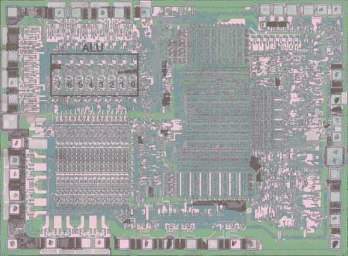

# 8085 ALU 的结构

> 原文：<https://hackaday.com/2013/01/25/how-the-8085-alu-is-structured/>

这是一张 8085 处理器芯片的显微照片。[Ken Shirriff]在他对算术逻辑单元如何工作的解释中使用了这张图片。它只能进行五种基本运算:加、或、异或、与和右移。[Ken]提到左移的缺失是通过将数字本身相加来弥补的，这具有将一个数字乘以二的效果；由移位操作执行的相同的数学功能。

他的文章详细描述了每个 ALU 操作的门排列。这一点很清楚，也很容易理解，它是基于一个团队已经完成的逆向工程工作，该团队仔细地对芯片进行了去盖和拍照。

不久以前，这种解释对我们来说还是巫术。但是我们通过跟随[在线 Nand 到 Tetris 课程](http://hackaday.com/2012/10/11/programming-tetris-by-first-building-a-logic-gate-then-a-computer-then/)学习了*计算系统元素*教科书。它真正揭开了像 8085 这样的芯片的内部工作原理。

现在，如果你真的想理解这个 ALU，你可以在《我的世界》里为自己建造它。

[谢谢艾德]