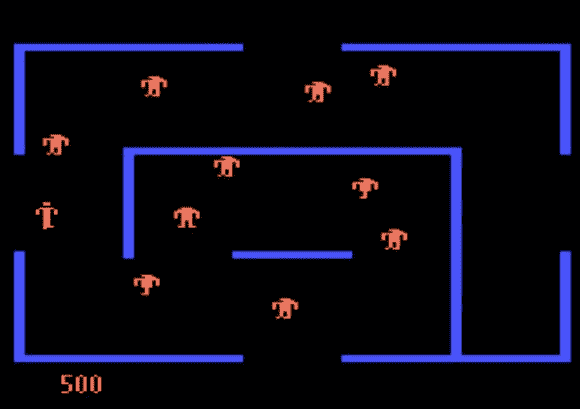

# 经典 Berzerk 游戏中的迷宫是如何产生的

> 原文：<https://hackaday.com/2013/07/21/how-the-mazes-were-generated-for-classic-berzerk-game/>

这是来自雅达利 5200 版经典游戏*狂暴*的截图。但是我们的特写实际上看的是最初的投币版本。每一层的迷宫都是使用输入基本算法的种子号动态建立的。这里仔细看看[迷宫建筑代码实际上是如何工作的](http://www.robotron2084guidebook.com/home/games/berzerk/mazegenerator/code/)。

最近，我们看了《陷阱》创作者【大卫·克拉尼】的一次演讲，这是我们回顾系列的一部分。这是编程历史上的一个真正的瑰宝，我们最喜欢的一点是关卡不是硬编码的，而是使用随机数生成器算法和硬编码种子构建的(这样每次玩游戏都是一样的)。这使用了一个类似的方法，但是种子有点随机。

通过在 MAME 模拟器中观察游戏，并通过挖掘反汇编代码，迷宫建筑被逆向工程。每次代码被“冷启动”时，种子从零开始，但是从那里房间号被用作下一个种子。这是通过一个非常简单的算法。它为墙壁生成方向，使用少量逐位操作在房间内添加柱子。

如果你正在为你的嵌入式项目编写游戏，这是一个很好的学习机会。通过编程生成房间，你不会用尽太多的程序内存。当然，现在即使是简单的爱好控制器也比艾伦·麦克尼尔设计狂暴时有更多的存储空间。

[via [Reddit](http://www.reddit.com/r/programming/comments/1ik1pv/how_it_works_explanation_of_the_random_number/)

[ [图像来源](http://www.8-bitcentral.com/reviews/5200berzerk.html)