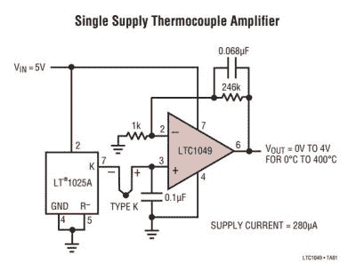
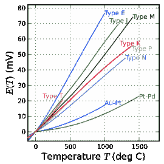
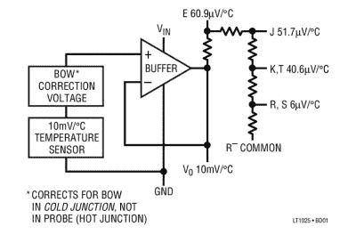
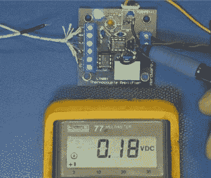
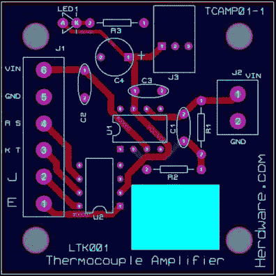
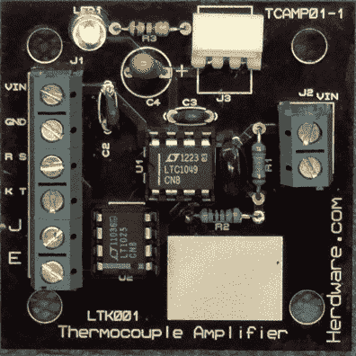

# 如何构建热电偶放大器

> 原文：<https://hackaday.com/2015/04/06/how-to-build-a-thermocouple-amplifier/>

热电偶是测量温度的绝佳方式。温度变化对不同金属的影响会产生可测量的电压。但要进行这种测量，你需要一个针对所用热电偶设计的放大器电路。

Linear Technology LTC 1049 Low Power Zero-Drift Operational Amplifier
with Internal Capacitors

继[我的仪表放大器视频](http://hackaday.com/2015/03/16/instrumentation-amplifiers-and-how-to-measure-miniscule-change/)之后，我在研究“零漂移放大器”时，注意到了这里显示的 [LTC1049 数据手册](http://cds.linear.com/docs/en/datasheet/1049fb.pdf "Low Power Zero-Drift Operational Amplifier with Internal Capacitors")首页的小原理图。我认为这是一个模拟应用的理想例子，需要一些增益和一些“增益助手”来完成我们放大热电偶探头的有用小应用。

在视频中，除了我经常看到的 k 型热电偶之外，我并没有过多谈论热电偶本身。如果您还不熟悉这些探头的结构，您可以在维基百科页面的[上找到关于热电偶和不同类型热电偶的资料性文章，如果您想了解更多信息，您也可以查看 ADI 公司](http://en.wikipedia.org/wiki/Thermocouple)[的应用笔记](http://www.analog.com/media/en/training-seminars/design-handbooks/temperature_sensors_chapter7.pdf "Analog Devices TEMPERATURE SENSORS")。我将介绍一种可靠而精确的方法来读取这些探针，在下面的视频和休息后的文章中可以看到。

[https://www.youtube.com/embed/65ykQh3cUDk?version=3&rel=1&showsearch=0&showinfo=1&iv_load_policy=1&fs=1&hl=en-US&autohide=2&wmode=transparent](https://www.youtube.com/embed/65ykQh3cUDk?version=3&rel=1&showsearch=0&showinfo=1&iv_load_policy=1&fs=1&hl=en-US&autohide=2&wmode=transparent)

不同的热电偶传感器具有不同的[温度系数](http://en.wikipedia.org/wiki/Temperature_coefficient "Temperature coefficient")，这意味着对于相同的温度变化，它们将产生不同量的电压，通常以每摄氏度的伏特数(v/♀C)来表示。知道传感器的温度系数只是等式的一半，我们还需要确定零点，这意味着我们要建立一个校准的参考点。应用已知的温度，例如将传感器浸入冰水中，是建立已知参考温度的一种简单但不方便的方法。基本上我们可以归零，然后测量伏特每摄氏度的变化。下图显示了

Thermocouple Temperature Response

或者，我们可以使用冷结补偿器(CJC)，如 [LT1025](http://www.linear.com/product/LT1025 "LT1025 - Micropower Thermocouple Cold Junction Compensator") ，这种芯片不仅可以复制各种热电偶的不同温度系数，还可以提供非常合理的校准。

在幕后，CJC 充当另一个热电偶或温度计，改变热电偶看到的电压，在我们的例子中是在室温下，并校正一些其他非线性。由于热电偶由 CJC 驱动，因此热电偶的输出相当线性且经过相当校准。

LT1025 – Micropower Thermocouple Cold Junction Compensator

对于这个快速演示，我更进一步，使用了 Linear Technology 的芯片组 [LTK001](http://cds.linear.com/docs/en/datasheet/LTK001fa.pdf "Thermocouple Cold Junction Compensator and Matched Amplifier") (PDF)，它由一个 LT1025 CTC 和一个单独称为 LTKA0x 的匹配放大器组成。快速浏览一下 LTKA0x 的规格，就能了解它在该应用中的工作原理:它具有高开环增益和极低的输入电流和输入电流误差。ADI 公司[有一篇关于开环增益](http://www.analog.com/media/en/training-seminars/tutorials/MT-044.pdf) (PDF)的精彩文章，我们可以在未来讨论更多关于偏置电流和误差的内容。

我使用的原理图在这里，由几个不同的示例电路组成，如果我要将这个电路作为生产运行，我想我还会包括一个调整电位计(和一个校准程序。).

  Thermocouple Amplifier  Thermocouple Amplifier Schematic

PCB 层如下所示，如果有人感兴趣，我可以提供 Gerbers。底部是接地层填充，这就是接地痕迹不易被发现的原因。

利用该电路，您可以实现一个简单的热电偶放大器，只要它具有模数转换器(ADC ),就能为您提供足够的增益，以便与您喜欢的控制器接口。由于读数是毫伏每摄氏度，你必须在软件中转换成华氏温度，这应该很简单。

  Thermocouple Amplifier PCB  Thermocouple Amplifier Assembly