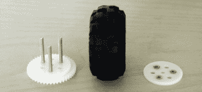

# 如何使用 Delrin 和激光切割机制作任何东西

> 原文：<https://hackaday.com/2015/09/03/how-to-build-anything-using-delrin-and-a-laser-cutter/>

需要一个简单的 fab 流程，在几分钟内从不起眼的矢量图形变成最终零件？CO [2] 激光切割机可能是正确的选择。随着这些工具通过黑客空间向广泛使用开放，我决定给 Delrin 一些受之无愧的聚光灯下的时间。

The laser cutter yet-again proves itself a formidable tool with the construction of [GameCube-Bot V2](http://www.doublejumpelectric.com/projects/gamecube_robot_2/2014-08-21-2014-gamecube-bot_2/)

本指南是我在过去几年使用激光切割 Delrin(又名乙缩醛)制作功能原型时，从他人那里学到的或自己发现的技巧和技术的简要集合。我希望这个指南对你有所帮助，因为我们一直在探索材料的极限。

作为免责声明，请记住，这些技术绝不是 Delrin 独有的，也不限于 Delrin。许多人不仅年龄大，而且在工程设计或当地机械车间也很常见。这篇文章只是强调了这里显示的技术，使用 Delrin 和几个手动工具可以重复和可预测地执行，我希望与越来越多的激光切割机爱好者分享它们。

## 为什么是德林？

我不否认我以前看过关于“激光切割技术”的帖子。然而，这些过去的文章大多倾向于将丙烯酸树脂或 T2 木材作为“选择的材料”，而且并非所有这些技术都可以跨材料转移。与丙烯酸树脂相比，Delrin 更具延展性，与木材相比，delrin 更接近连续体。这两个特征使得许多附加的设计技术成为可能，这些技术对于像丙烯酸和木材这样的材料来说是不切实际的或者难以实现的。

## Delrin 原型技术

### 压配合

加工金属时，两个零件之间的压配合要求公差小于 0.0005 英寸。(0.0127 毫米)，这样，压在一起的两个零件将轻微变形，在正常工作条件下不会分离。Delrin 由于其柔韧性，更愿意变形以适应压配合。这个事实是业余爱好者激光切割机的救命稻草。这意味着，即使我们的激光切割机精度稍低，我们仍然可以*在两个 Delrin 零件(或仅一个 Delrin 零件)之间实现压配合，因为 Delrin 愿意变形为另一个零件的形状。作为信封背面的规则，如果您的激光切割机可以达到 0.001 英寸的特征之间的相对尺寸。(0.0254 毫米)，只是比孔(或其他压配合几何形状)略小，比传统压配合略小，Delrin 仍然能够膨胀并牢牢固定零件。*

在上图中，线性滑轨被压入 Delrin 中，Delrin 很好地容纳了两个滑轨，没有出现裂缝。在正常操作下，由于 Delrin 的压缩力从孔的外壁推回轨道，轨道将保持在原位。轴承也是压配合的。

相比之下，这种技术*不能以任何可重复的方式*应用于丙烯酸树脂。丙烯酸很脆。因此，试图将金属定位销(或其他类似零件)推入丙烯酸树脂的孔中，使其承受内应力，只会导致零件裂开或粉碎。

### 钻孔装埋

 Delrin 易于加工——简单到你甚至不需要一台合适的机器就能在零件上钻埋头孔！下面，GameCube-Bot V2 的马达板的埋头螺孔是用一个小埋头孔手工完成的。

### 螺纹成型

通过任何老练的技术，“在我们之前的古鲁们”已经开发出了一种适合这种情况的工具。在这种情况下，工具是一系列稳定的[自攻螺钉](http://www.mcmaster.com/#thread-forming-screws/=ymhg79)，使我们能够直接拧入许多材料，而无需攻丝。足够方便的是，Delrin 的延展性非常好，甚至不需要这些螺钉！只需将孔的尺寸调整到[合适的丝锥尺寸](http://www.physics.ncsu.edu/pearl/Tap_Drill_Chart.html)，并用手将其拧入。

作为另一个免责声明，这种技术也不适用于丙烯酸和木材。丙烯酸树脂太脆，无法通过螺纹切割或变形，胶合板无法预测螺纹，因为它是许多层木材胶合在一起的复合材料。

### 搭扣配合

 Delrin 的延展性使其成为搭扣配合的良好候选材料。搭扣配合背后的主要想法是，您的组装过程将在凸耳上引入临时应力，以便它可以被推入槽中，然后在凸耳完全插入后释放。丙烯酸树脂可以很好地处理压缩载荷，但它的拉伸强度非常差，这使得它成为可靠搭扣配合接头的不合理选择。然而，Delrin 更适合这种技术。

在你得意忘形地设计任意搭扣配合之前，请记住，在大规模生产的消费品中重复使用这种技术，会有大量的研究和公式。

### Delrin 橡胶三明治

Delrin 是出了名的滑溜，所以如果没有固定好，我们应该预料到碎片会很容易滑落。如果我们希望在表面之间获得更多的抓地力，我已经成功地在 Delrin 和它的配合表面之间设置了一层薄薄的 Santoprene 橡胶(也是激光切割的)。由此产生的橡胶夹层具有更大的摩擦力，特别是通过螺钉施加足够的法向力。

### **车轮**

被称为“O 型圈三明治”的你也可以在必要时制作自己的车轮！这项技术背后的想法是将三个 Delrin 板夹在一起，其中心直径略小，这样 o 形环就有一个凹槽可以放置。Delrin 的冲击强度至少是丙烯酸的两倍(约 1.2 英尺-磅/英寸对 0.4 英尺-磅/英寸)，这使它成为这些(机器人？)轮子会探索。最后，三块板的夹层厚度足以克服 Delrin 固有延展性可能带来的任何脆弱缺陷。

这里显示的图像有一个用车床制作的定制铝轮毂，但你也可以购买[轮毂](https://www.pololu.com/category/137/pololu-universal-mounting-hubs)来做同样的事情。

### 齿轮

在“现实生活”中，Delrin 因其耐磨性而闻名，我们可以发现它作为衬套甚至齿轮出售。然而，为什么要让零售商独享所有的乐趣呢？使用足够高功率(60W 及以上)的激光切割机，您也可以激光加工自己的齿轮！

一个公平的预警:虽然激光切割机肯定可以切割 64 节齿，但齿轮的表面光洁度足以与相同节距的正确制造的齿轮啮合的可能性相当低。锥度(见本文之后将发表的*缺点*帖子)，加上齿轮齿的熔化表面光洁度都将对齿轮的质量产生负面影响——但也许这些缺点在您的应用中并不妨碍交易，熔化的齿只是“足够好了吗？”

### 弹簧销

并非所有的激光切割机都能始终如一地切割较厚的(. 1875 [in]或更厚)Delrin 片。此外，Delrin 在被挤压后易于翘曲。无论你是试图创造一个更厚的板，还是试图通过将两个弯曲的板固定在一起来拉直它们，弹簧销都可以帮助这两种努力。弹簧销是压入孔中的钢卷。一旦安装好，它们通过在孔的内壁上施加压力来保持它们的位置，这使得它们非常适合一次性安装，并且如果你搞砸了很难移除。要安装它们，我建议用一台乔木压机。

### 滑轮

 还记得我提到的 Delrin 很滑吗？现在是时候利用这个有趣的事实，并把它付诸实践了。这项技术背后的想法是将三到四个 Delrin 椎间盘一起夹在一个带肩螺钉上，每个椎间盘上的孔足够大，以允许椎间盘平稳运行。或者，你也可以用一个轴承代替内盘，只要你选择一个尺寸过小的带肩螺钉。

## 下次请继续收听

这星期就这些了！两周后再来看第二部，在那里我将探索与 Delrin 一起工作的缺点(提示:你不能把东西粘在一起！)以及如何围绕它们开展工作。

对于这里记录的许多技术，我非常感激在过去几年里与一些优秀的工程师一起度过的时光。感谢[Steph]、[JB](http://projectsbyjb.blogspot.com/)和[Chris]为本指南中的一些想法提供的所有专业建议！

最后，关于 Delrin 材料特性的详细分析，请看一下[杜邦公司的设计指南](http://www.dupont.com/content/dam/dupont/products-and-services/plastics-polymers-and-resins/thermoplastics/documents/Delrin/Delrin%20Design%20Guide%20Mod%203.pdf)。