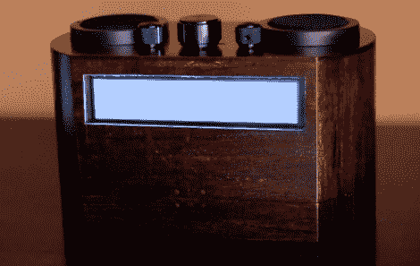

# 如何建立自己的专用潘多拉收音机

> 原文：<https://hackaday.com/2012/09/20/how-to-build-your-own-dedicated-pandora-radio/>

这种现代与复古的混合充当了独立的潘多拉客户端。这无疑是收音机的升级，介于传统广播的被动收听和使用播放列表的音乐播放器的完全控制之间。

木箱内的猎兔犬板完成了大部分工作。它运行的是 Ubuntu 12.04，Pandora 的命令行界面包 piano bar T1 也在这个版本上运行。这些组件本身就能带来非常好的聆听体验，但由于 Pandora 将不同的音乐混合在一起，所以能够看到你在听什么是很好的。四线 LCD 足够宽，可以显示大量信息。它由 PIC24 微控制器控制，该微控制器也监控顶部的控制。正如你在休息后的视频中看到的，用户界面提供了你想要的几乎所有东西。很容易切换电台，您仍然可以在正在播放的每个曲目上注册您的偏好。

[https://www.youtube.com/embed/n4m9QUUZ4_Q?version=3&rel=1&showsearch=0&showinfo=1&iv_load_policy=1&fs=1&hl=en-US&autohide=2&wmode=transparent](https://www.youtube.com/embed/n4m9QUUZ4_Q?version=3&rel=1&showsearch=0&showinfo=1&iv_load_policy=1&fs=1&hl=en-US&autohide=2&wmode=transparent)

[via [Twitter](https://twitter.com/JumperOnePhil/status/246354801179361280)