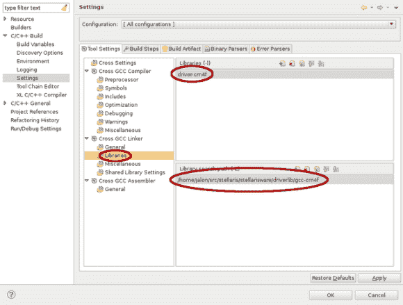

# 如何为 Stellaris Launchpad 配置 Eclipse

> 原文：<https://hackaday.com/2012/12/05/how-to-configure-eclipse-for-the-stellaris-launchpad/>

我们倾向于在 AVR 项目中使用 gedit 和 makefile。但是在大多数情况下，我们没有针对这些较小芯片的调试器。现在我们开始使用 ARM 处理器，我们一直在使用调试，Eclipse 是一种将代码编写、编译和调试结合在一起的好方法。当然，我们可以使用 TI 提供的 ide(其中一些基于 Eclipse)，但是我们更愿意自己构建工具。[Doragasu]正在用他的[Eclipse for stellar is launch pad 教程](http://kernelhacks.blogspot.com.es/2012/11/the-complete-tutorial-for-stellaris_25.html)制作这个快照。

他用如上图所示的截图说明了每个步骤。这里，他将 StellarisWare 中的 driverlib 包含在链接步骤中。当所有的编译器和链接器设置正确后，你需要做的就是复制一份模板来开始一个新的项目。设置的最后一部分配置 lm4flash 将二进制文件写入芯片，并配置 OpenOCD 供调试时使用。

[via [评论](http://hackaday.com/2012/12/04/a-study-of-gcc-and-the-ti-stellaris/#comment-897735)