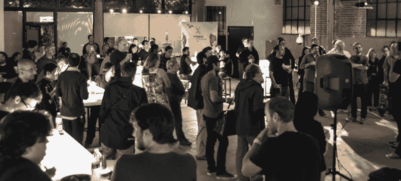
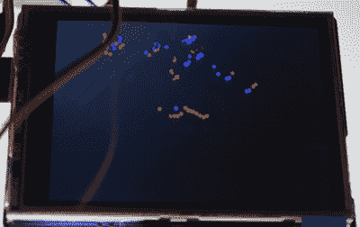

# 如何制作硬件，有例子和一个电泡菜

> 原文：<https://hackaday.com/2015/05/10/how-to-make-hardware-with-examples-and-an-electric-pickle/>

现在我们正在帕萨迪纳举办一场为期两天的黑客马拉松。就像所有的黑客马拉松一样，人们会建造一些东西，但那只会发生在今天。昨天是一场令人难以置信的零距离产品对话，内容涉及 PCB 布局技术、制造和原理图捕捉。在*七个小时的演讲*中，我们自己的【马特·博格伦】带领观众完成了一个产品的制作，在这里是一个小小的 ESP8266 分线板。我们对此进行了直播。视频(还有电泡菜)在下面。

[https://www.youtube.com/embed/NgCenBZMgvc?version=3&rel=1&showsearch=0&showinfo=1&iv_load_policy=1&fs=1&hl=en-US&autohide=2&wmode=transparent](https://www.youtube.com/embed/NgCenBZMgvc?version=3&rel=1&showsearch=0&showinfo=1&iv_load_policy=1&fs=1&hl=en-US&autohide=2&wmode=transparent)

在会谈结束时，每个带着笔记本电脑和 Eagle 的人都有了一个 PCB 设计，可以在他们的屏幕上工作。[Matt]教了大约 100 个人 EagleCAD。这真的很了不起，不仅仅是因为老鹰有点可怕。

昨天的前七个小时充满了会谈，但之后有一个派对，人们带来了黑客，建筑，巨大的米勒焊机，但没有正确的电线将米勒插入 30A 220V 电路。

* * *

#### 激光雷达

 【史蒂夫·科林斯】是 Hackaday 设计实验室的常客。去年，在我们的 10 周年庆典上，[他做了一个关于](https://www.youtube.com/watch?v=9EQXhEW4Gl8)如何黑进美国国家航空航天局的演讲。他这个周末带着一个非常棒的项目回到太空:他建造了一台激光雷达。

这个距离测绘机器人使用了来自 Sparkfun 的激光雷达 Lite [，spark fun](https://www.sparkfun.com/products/13167)之前是[的一个众筹活动](https://www.dragoninnovation.com/projects/32-lidar-lite-by-pulsedlight)。该传感器使用红外激光和“脉冲光信号”来确定到物体的距离。[史蒂夫]让传感器在伺服系统上旋转，输入到 Arduino 上，并在 TFT 显示屏上显示类似《T4》外星人的“移动物体道具”的东西。它可以探测到房间里的物体，据说最远可达 40 米。

#### 3D 扫描

来自 Deezmaker 的家伙带来了一些他们的 3D 打印机和 3D 扫描设备。它只是一个转盘、一台 Kinect 和一点线性轨道，但他们能够扫描六个人左右，并打印出微型副本。

#### 电泡菜

泡菜里有很多盐。将两个电极放入泡菜中，让一千瓦的电流通过它们，你会得到一个壮观的表演，可能还会晒黑。23b 黑客空间的一些工作人员把一个巨大的米勒装进一辆吉普车，开着它去参加活动。Hackaday 设计实验室显然有一些 30A 220V 电路，23b 有足够长的延长线:

[https://www.youtube.com/embed/M9WyV72cjRo?version=3&rel=1&showsearch=0&showinfo=1&iv_load_policy=1&fs=1&hl=en-US&autohide=2&wmode=transparent](https://www.youtube.com/embed/M9WyV72cjRo?version=3&rel=1&showsearch=0&showinfo=1&iv_load_policy=1&fs=1&hl=en-US&autohide=2&wmode=transparent)

这是当晚的亮点，我们没有烧毁空间。太棒了。

我们今天一整天都会带着一箱箱的开发板、组件、烙铁和一些很棒的 LeCroy 示波器出现在这个空间。如果你在洛杉矶，出来吧。