# 如何制作黑客空间护照印章

> 原文：<https://hackaday.com/2015/05/22/how-to-making-a-hackerspace-passport-stamp/>

几年前，Noisebridge 的 Mitch Altman 提出了一个黑客空间护照的想法。其背后的想法不是阻碍或监控旅行，而是鼓励访问其他黑客空间。这些护照只需几美元就能买到，或者，以真正开源的方式，只用一台电脑打印机就能制作出来……黑客空间的护照设计文件是完全免费的，可以在[这里](https://www.noisebridge.nimg/0/0c/Hackerpass08.pdf)获得。

所以下次你去一个新的黑客空间时，带上你的护照，并在护照上盖章以记录你的旅程。这就把我们带到了这篇文章的重点:邮票。大约 25 美元，在办公用品店做一个定制的墨水印章不是很多钱，但是买一个邮票没有做一个有趣！这就是我们今天要做的；制作一枚邮票…或者更具体地说，用不同的技术制作几枚邮票。然后我们将比较每种方法的性能。

## 设计

 [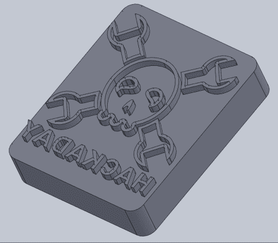](https://hackaday.com/2015/05/22/how-to-making-a-hackerspace-passport-stamp/sw-stamp/) Stamp 3D Model [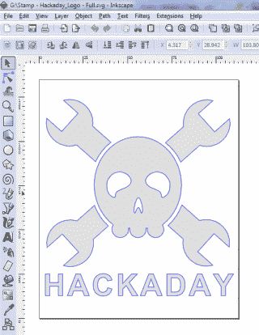](https://hackaday.com/2015/05/22/how-to-making-a-hackerspace-passport-stamp/inkscape-stampsolid/) Inkscape solid HaD logo  Inkscape Lined HaD Logo [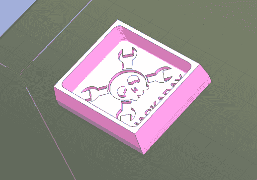](https://hackaday.com/2015/05/22/how-to-making-a-hackerspace-passport-stamp/afinia-mold/) Printed Stamp Mold [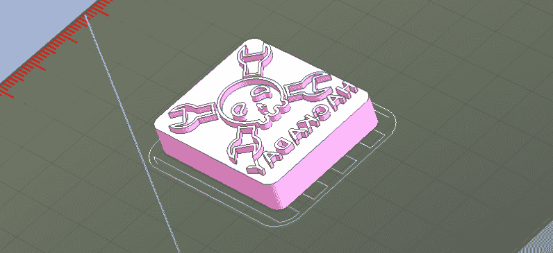](https://hackaday.com/2015/05/22/how-to-making-a-hackerspace-passport-stamp/afinia-stamp/) Printed Stamp STL

因为今天是黑客日，我们将制作一个黑客日标志邮票。几年前，我们举办了一场[竞赛](http://hackaday.com/2013/10/21/pander-to-us-and-win-a-trinket/)，要求人们制作带有 Hackaday 标志的独特物品。为了方便参赛者，Hackaday 的徽标以 [SVG](http://hosted.hackaday.com/Hackaday_Logo.svg) 格式提供。我们将从这一点开始，因为它是可用的，并通过添加一些字母来做一个小小的改变，因为大多数即将成为邮票制作者的人可能也希望他们的邮票上有字母。这在 FOSS 矢量图形编辑器软件中很容易做到: [Inkscape](https://inkscape.org/) 。

邮票的大小很重要。Hackerspace 护照页面可容纳 4 枚最大 41 x 47mm 毫米的邮票，我们会尽量将邮票控制在这些范围内。

## 材料

如前所述，我们将使用几种制作邮票的方法并对它们进行比较。当然，有数不清的方法来制作图章，我们将尝试黑客空间通常可以使用的方法和工具。

 [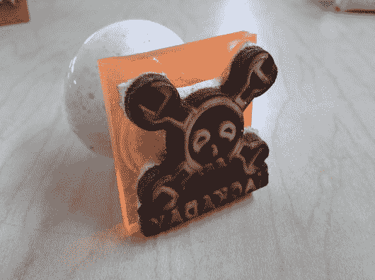](https://hackaday.com/2015/05/22/how-to-making-a-hackerspace-passport-stamp/stamp-laserline/) Lasered Line Stamp [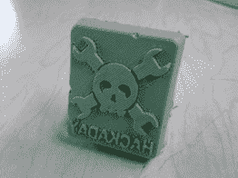](https://hackaday.com/2015/05/22/how-to-making-a-hackerspace-passport-stamp/stamp-replication/) Replication [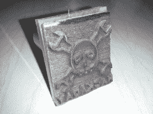](https://hackaday.com/2015/05/22/how-to-making-a-hackerspace-passport-stamp/stamp-wood/) Lasered Wood [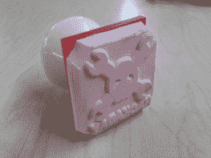](https://hackaday.com/2015/05/22/how-to-making-a-hackerspace-passport-stamp/stamp-milledsolid/) Milled Solid Stamp [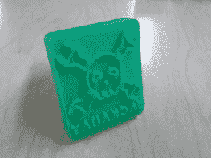](https://hackaday.com/2015/05/22/how-to-making-a-hackerspace-passport-stamp/stamp-abs/) ABS printed stamp [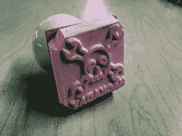](https://hackaday.com/2015/05/22/how-to-making-a-hackerspace-passport-stamp/stamp-milledline/) Milled Line Stamp [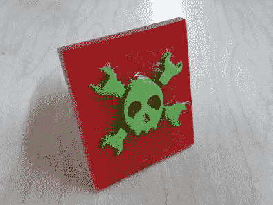](https://hackaday.com/2015/05/22/how-to-making-a-hackerspace-passport-stamp/stamp-hobbyfoam/) Hobby Foam Stamp [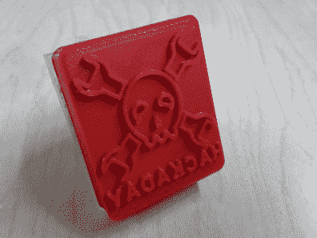](https://hackaday.com/2015/05/22/how-to-making-a-hackerspace-passport-stamp/stamp-flexpla/) Flexible PLA

#### **印章橡皮**

这可以在业余爱好或工艺品商店买到。它是专门为冲压制造的，我们将把它作为一条基线。我们将会用橡皮制作总共 4 张邮票。前两个将是一个标准的 Hackaday 标志，但每个都将使用不同的工具；激光切割机和迷你数控刳刨机。

第三枚和第四枚邮票也是由橡胶邮票制成，将有“线”的形状。过去，大的扁平实心形状由于不能很好地转移油墨而导致问题，留下不一致的污点图案。同样，我们将在激光切割机上做一个，在 CNC 路由器上做一个。

#### **爱好泡沫**

这种材料很容易用激光切割机切割。它比橡胶更柔软，更有弹性，厚度为 2 毫米。这是一种非常便宜的材料，在任何工艺品商店都可以买到。

#### **木头**

这将用激光切割机切割出来。每个人都可以接触到一小块木头，让我们看看它是否是制作邮票的合理材料。

#### **3D 打印塑料**

3D 打印将被用作邮票本身。印刷塑料又硬又滑。我们过去的经验是，这种方法看起来不太好，但 3D 打印机是黑客空间中非常常见的工具，所以让我们试试吧！我们的邮票将印有 ABS。

#### **3D 打印柔性 PLA**

这种 3D 打印将以与塑料邮票相同的方式打印，但材料明显更像橡胶，更有弹性。看看这种材料效果如何会很有趣。这枚邮票将使用 Form Futura 柔性 PLA 长丝印刷。

#### **带填缝铸造的 3D 打印模具**

3D 打印机是一个很好的工具，但我们预计 3D 打印的邮票可能由于材料属性而表现不佳。对于这个测试，将打印一个模具，并用硅酮填缝剂填充。固化的填缝料然后将被移除，并有希望产生可用的印模。和 3D 打印的塑料印章一样，这个模具也是用 ABS 打印的。

## 用激光切割机制作

 [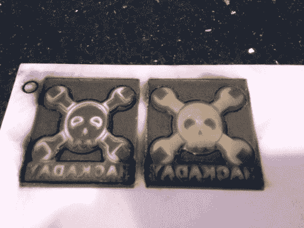](https://hackaday.com/2015/05/22/how-to-making-a-hackerspace-passport-stamp/process-laser2/) That burnt look is on there for good  Burning Rubber!   [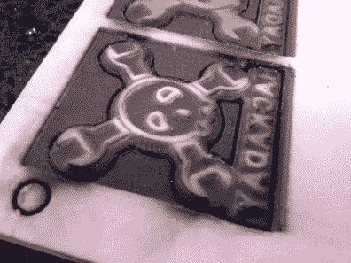](https://hackaday.com/2015/05/22/how-to-making-a-hackerspace-passport-stamp/process-laser3/) lasered rubber, smells bad, looks good  Hobby foam. Where’d the letters go?

我们从 Hackaday Logo SVG 文件开始，并在 Inkscape 中对其进行了修改。然后在 Corel Draw 中打开，发送到激光切割机，在这种情况下是一个 Epilog。幸运的是，Epilog 打印驱动程序具有图章功能。打开 SVG 文件后，验证图章的大小是否正确。然后画一个矩形围绕邮票的几何形状，使线类型'发际线'。软件的图章功能将需要这个矩形来限制图章的浮雕(激光)部分。要打开图章功能，在 Corel Draw print 对话框中点击“打印属性”进入 Epilog 驱动程序对话框。单击“高级”选项卡显示图章选项。选中“镜像”会反转图像，因此物理印章上的图像会反转，但油墨印章会以正确的方向出现。邮票功能也将把 Epilog 所谓的肩膀放在艺术品周围，加强实体邮票的薄区域。我们使用了 30%的速度和 100%的功率，并且必须做 3 次才能得到足够深的切口。

从物理上来说，激光图章橡胶的效果很好，但也会被烧焦。甚至非激光区域也因烟雾而变色。用肥皂和水擦洗没有任何明显的区别。这种变色对邮票的性能没有影响。

然后我们转向了像黄油一样切的泡沫。通常这是一件好事，但它也融化了泡沫，留下了一个很宽的切口，宽到字母最终只是孔。

## 使用 CNC 路由器制作

 [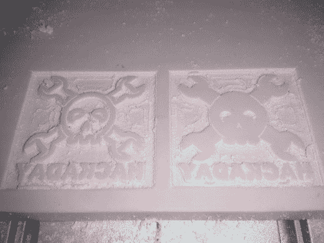](https://hackaday.com/2015/05/22/how-to-making-a-hackerspace-passport-stamp/process-milled4/) all cuts are done [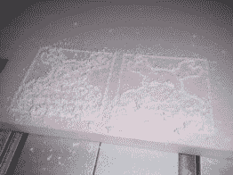](https://hackaday.com/2015/05/22/how-to-making-a-hackerspace-passport-stamp/process-milled1/) there’s a stamp under there somewhere [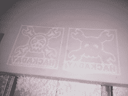](https://hackaday.com/2015/05/22/how-to-making-a-hackerspace-passport-stamp/process-milled2/) after the v-bit pass [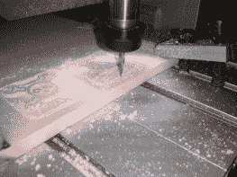](https://hackaday.com/2015/05/22/how-to-making-a-hackerspace-passport-stamp/process-milled3/) In process!  LinuxCNC 0.060″ endmill tool path  LinuxCNC, 30 deg v-bit tool path

从 Inkscape 的 SVG 文件开始，我们需要将其保存为 CAM(计算机辅助制造)软件中使用的格式，该软件将获取图像几何图形，生成刀具路径以切割出印记，并保存 g 代码文件。保存为 DXF 文件导致了一些兼容性错误，所以我们用 PDF 格式，效果很好。在从 Inkscape 导出文件之前，应该反转图像。没有什么比剪好邮票后发现邮票印反了更糟糕的了！CAM 软件要求您指出正在使用的刀具类型以及切削深度。我们将使用 30 度尖头雕刻钻头，切割深度为 0.060 英寸。与直端铣刀相比，30 度钻头有两个优点:

1.  该角度将为薄印模特征提供一些支持(类似于尾迹的肩部特征)。
2.  钻头的尖端可以用来在印模上制作非常精细的细节。

我们使用一个名为 [VCarve](http://www.vectric.com/products/vcarve.htm) 的程序来生成 g 代码。这是一个易于使用的程序，但不便宜，起价 350 美元。一个免费的 CAM 软件替代品是 [CAMBAM Free](http://www.cambam.info/downloads/) 。尽管我们的观点是 CAMBAM Free 是最好的免费 CAM 软件，但有理由期待一个漫长的学习曲线和许多如何使用它的网络搜索。

机床控制软件如 [LinuxCNC](http://linuxcnc.org/) 或 [Mach3/4](http://www.machsupport.com/software/mach3/) 将能够加载 CAM 软件创建的 g 代码文件，并随后控制 CNC 机床切割印记。我们在这个项目中使用的是免费开放的 LinuxCNC，但是 Windows 专用的 mach 3(175 美元)也同样有效。

用于制作邮票的 CNC 机器是一种普通的无品牌机器，通常称为 [CNC3020](http://hackaday.com/2014/02/15/chinese-3020-cnc-machine-gets-some-upgrades/) 。搜索这个词将会返回易贝上许多售价约为 600 美元的卖家。

我们只希望进行两次切割:用 0.060 英寸的直端铣刀去除大部分材料，然后用 30 度 v 形钻头进行细节切割。完成前两遍后，有相当多的“橡胶毛刺”剩余。这些第一遍是在[爬升-铣削](http://www.richardsmicrotool.cimg/climbmillinglg.jpg)方向上完成的。然后创建并运行另外两个程序来进行相同的切削，但方向是传统的铣削方向。这清理了许多不需要的橡胶，但仍然需要用牙刷好好摩擦和擦洗，才能将邮票清理到令人满意的程度。仔细观察 v 形钻头切割时，橡胶在 v 形钻头经过时明显移开，然后又弹回原来的位置。这种行为不是预期的，并且是一些不清楚特征的原因，例如实心头骨上的鼻子或头骨和扳手之间的间隙。

## 用模具制作

 [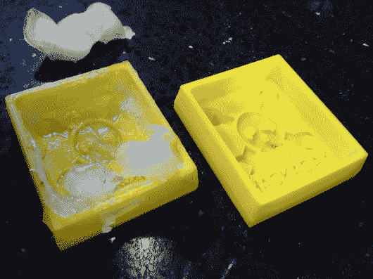](https://hackaday.com/2015/05/22/how-to-making-a-hackerspace-passport-stamp/process-mold1/) Caulk didn’t work so well  impression material tube [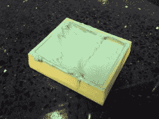](https://hackaday.com/2015/05/22/how-to-making-a-hackerspace-passport-stamp/process-mold2/) mold filled up with 2 part impression material [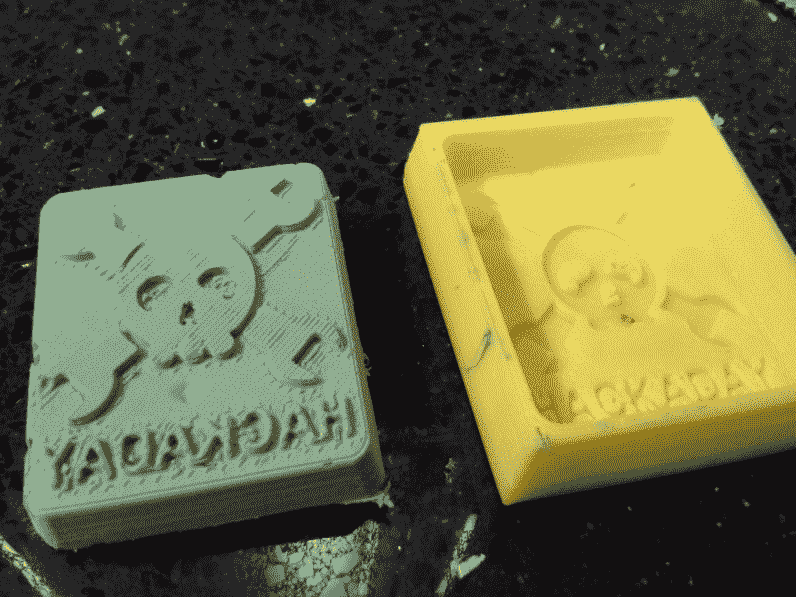](https://hackaday.com/2015/05/22/how-to-making-a-hackerspace-passport-stamp/process-mold3/) The replication looks good

使用 3D 打印模具和硅胶填缝剂根本不起作用。模具印刷效果很好，但“印模”中心的填缝剂没有固化，因此无法整体移除。这种方法彻底失败了。只是碰巧我们有一些印象材料。这种类型的材料如此容易获得并不常见，但我们做到了，所以我们要使用它！印模材料是两部分的混合物，无论应用有多厚，它都会固化。印模材料很好地填充了大部分空隙，并且很容易从模具中取出。我们注意到的一个问题是，它很好地复制了 3D 打印模具的顶面，这意味着邮票的冲压部分具有来自纹理化 3D 打印顶面的脊。

## 完成邮票

软邮票被粘在一个垫板上，以防止邮票在微风中摆动，并在盖章时平衡整个邮票上的力。任何东西都可以用作把手；我们大多使用一些旧的宽底抽屉拉钮和短的小直径 PVC 管。这些把手被热粘在垫板上。

## 结果

冲压是在和他们肯定展示了各种各样的质量。点击照片查看详细信息。

[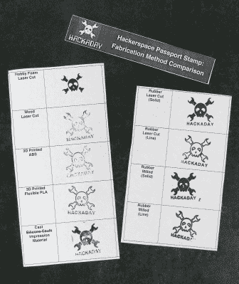](https://hackaday.com/wp-content/uploads/2015/05/results1.jpg)

Passport Stamp Test Results

正如你所料，所有的橡皮图章都印得很好，因为这种材料是为油墨图章制作的。它们看起来都很好，非常清晰，字母也很容易阅读。激光切割机和 CNC 刳刨机都用橡皮图章制作了一个非常有用的图章。

爱好泡沫转移墨水很好，但激光融化了精细的细节，薄部分和所有的文字。此外，5 个零件中的每一个都必须单独粘在支撑板上，这使得零件很难正确对齐。

木材和印刷硬 ABS 在转移油墨方面是最差的，即使几何形状出来很好。灵活的 PLA 工作得更好，对于没有 CNC 路由器或激光切割机的黑客空间来说，将是一个很好的选择。

不要尝试用填缝剂成型。即使这是一次彻底的失败，我们也在这个过程中学到了一些东西:不要去做。印模材料工作正常，但有纹理的印模表面和印模材料不常见的事实使其不是印模制作的最佳选择。

当制作油墨印章(或任何东西！)试验和尝试替代材料是完全合理的。我们希望这篇文章表明，没有一条路可以到达你要去的地方。随意混合和匹配冲压材料，方法和技术。请在评论中告诉我们你的经历。如果我们错过了一个对你有效的方法，让每个人都知道！

 [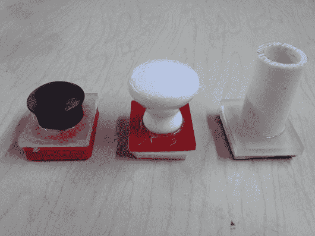](https://hackaday.com/2015/05/22/how-to-making-a-hackerspace-passport-stamp/handles/) Handle Types  Got Stamps? [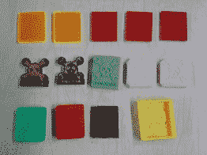](https://hackaday.com/2015/05/22/how-to-making-a-hackerspace-passport-stamp/allstamps1/) Hot off the press!