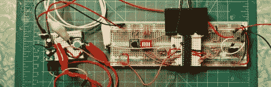

# 如何正确使用电子设备飞行

> 原文：<https://hackaday.com/2012/04/19/how-to-properly-fly-with-electronics/>

一些电子专业人员不得不相对频繁地乘坐飞机。一个这样的人，[史蒂夫·霍弗]和我们分享了如何正确地带着暴露在外的电线和碎片飞行而不会让[因被怀疑是恐怖分子而被 TSA 逮捕](http://hackaday.com/2008/09/19/boston-led-sweatshirt-arrestee-interviewed/)。这篇文章相当深入，提供了如何处理大多数情况的技巧，包括被拉到一边，放在一个小房间里接受询问。大部分归结为一个事实，你不能指望运输安全管理局的代理人是所有方面的专家。他们看到稍微有点不正常的东西，他们必须跟进。我们不是在这里谈论搜身和人体扫描仪，我们是在谈论电路板，胶带和电池组。

史蒂夫分享的一个故事特别幽默。他注意到伺服系统已经从他的一个机器人上断开。他想知道，为什么要把它们分开？如果他们被怀疑是爆炸物，他们就不应该乱动它们。如果不是…他们为什么要拔掉插头？