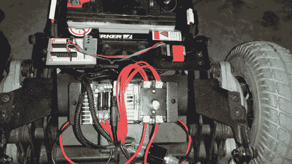

# 如何让奶奶的轮椅在超出遥控范围时停下来

> 原文：<https://hackaday.com/2014/01/26/how-to-stop-grandmas-wheelchair-if-she-goes-out-of-rc-range/>

好吧，据我们所知，他没有让奶奶坐在里面，但[zim]最近决定把一把时髦的轮椅变成“一个无线电控制的恶作剧平台”。RC 比 wifi 或蓝牙提供更大的覆盖范围，他能够在 Craigslist 上找到价格合理的二手收音机。然而，他发现，在信号丢失的情况下，接收器会继续向速度控制器发送最后的命令。[zim]不想让他 150 磅(68 公斤)的恶作剧平台变得松散，所以[他设计了一个自动防故障装置，当信号丢失时切断电机的电源](http://www.instructables.com/id/Failsafe-for-RC-Wheelchair/)。

[zim]发现，只要信号丢失，接收器就会将通道 3(油门)恢复到预设状态。他使用由 Arduino Nano 控制的 24V HVAC 继电器对通道 3 上的 PW 进行采样，并在节流阀或信号被切断时将其关闭。

如果奶奶脾气暴躁，你可以用购物车建造[这个被关在笼子里的版本。](http://hackaday.com/2013/12/17/shopping-trolley-is-wired-for-camp/)

 [https://www.youtube.com/embed/OvZhDf3FyyM?version=3&rel=1&showsearch=0&showinfo=1&iv_load_policy=1&fs=1&hl=en-US&autohide=2&wmode=transparent](https://www.youtube.com/embed/OvZhDf3FyyM?version=3&rel=1&showsearch=0&showinfo=1&iv_load_policy=1&fs=1&hl=en-US&autohide=2&wmode=transparent)