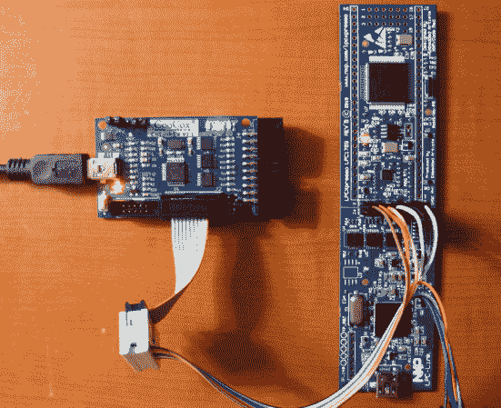

# 如何将 CoIDE 与 LPCXpresso 板配合使用

> 原文：<https://hackaday.com/2013/08/01/how-to-use-coide-with-lpcxpresso-board/>

[James Lynch]选择了 LPCXpresso 板，因为他想尝试 ARM 处理器。右侧显示的板提供了您开始工作所需的一切。它甚至附带了一个免费的 IDE。但不幸的是，Code Red IDE 的免费版本大小有限。如果他想取消这一限制，他将不得不支付 999 美元购买正版。一家公司可能不会对这笔费用三思而行，但在业余爱好领域，这是绝对不可能的。相反，[James]想出了如何使用 CooCox 编程器和 LPCXpresso 硬件。要获得他 59 页的过程指南，请点击该链接，点击右下角的“下载 Zip”按钮获取 PDF 文件的副本。

黑客分为两部分。首先，您需要更改 LPCXpresso 板。有一条中线将开发板与调试器/程序员分开。这些引脚通过成排的双引脚接头之间的焊桥连接。[詹姆斯]删除了桥梁，并添加了上述引脚标题。这使他能够跳线连接并正常使用，或将其连接到他的 CooCox 编程器上，如上所示。项目的第二部分介绍了获取免费 CoIDE(也基于 Eclipse)来为 LPCXpresso 编译和编程代码的过程。

我们随处可见这种开发板，特别是示波器版本中的[。](http://hackaday.com/2011/08/26/making-oscilloscopes-from-arm-development-boards/)