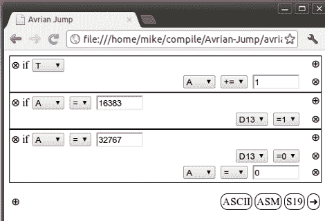

# 基于 HTML 的 AVR 编译器旨在使 Arduino 在 IOS 上的开发成为可能

> 原文：<https://hackaday.com/2012/04/10/html-based-avr-compiler-aims-to-make-arduino-development-on-ios-possible/>

令人惊讶的是，人们为了给他们的智能手机带来功能会走多远。在这种情况下，[Tadpol]想要在 iPad 或 iPhone 等 iOS 设备上开发他的 Arduino。他认为将 IDE 重写为 HTML5 是可能的，但由于这是一座需要攀登的大山，[他开始构建一个基于浏览器的 AVR 编译器](http://tadpol.org/projects/AvrianJump.html)。这是一个有趣的概念，他已经在 Github 上为你准备了[一个工作原型供你测试。也许你可以参与进来，帮助他发展？](https://github.com/tadpol/Avrian-Jump)

web 界面使用框来添加代码。你在上面看到的是三组会使 LED 闪烁的命令。该项目名为 Avrian Jump，使用简单的梯形语言来馈送编译器，并有几种不同的输出选项。我们最感兴趣的是一个 WAV 文件，它可以用来从你的设备的音频中编写 AVR。这将使编程变得简单，只需将经过特殊改造的 AVR 连接到耳机插孔即可。还有一个 ASCII 输出，允许你保存你的程序供以后修改，S19 输出用于 AVRdude 编程，汇编输出用于调试目的。很难看出这个项目可能会走向何方，但我们不得不承认这个概念很有趣。