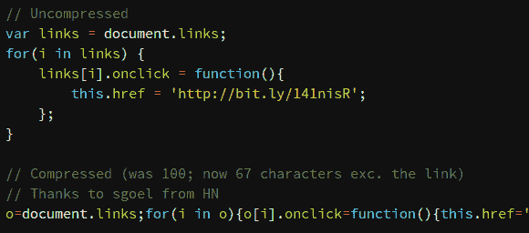

# HTML 链接标签黑客把你送到错误的地方

> 原文：<https://hackaday.com/2013/03/23/html-link-tag-hack-sends-you-to-the-wrong-place/>

我们认为自己是相当谨慎的网络战士。我们知道什么时候要提防恶意链接，在这种时候要小心谨慎。但是这种攻击仍然会伤害到链接追随者中最谨慎的人。这是一个[黑客程序，在你点击 后，一个链接会向你发送 ***。***](http://bilaw.al/2013/03/17/hacking-the-a-tag-in-100-characters.html)

当你将鼠标悬停在 PayPal 上时，帖子中的一个链接将 PayPal 列为目标，这一概念立即被人们所理解。点击它会给你一个警告，这可能是一个恶意网页，你被重定向到。当然，页面的地址栏显示你被发送到了其他地方，但这仍然是一个有趣的问题。黑客只需几行 JavaScript 代码就能完成。事实上，最初的例子是 100 个字符，但是修订版将它简化为 67 个。

那么谁容易受到这种事情的伤害呢？听起来好像每个人都没有使用 Opera 浏览器，该浏览器已经针对漏洞进行了修补。帖子底部还有一些更新，提到火狐已经得到通知，Chrome 正在开发补丁。

[via [Reddit](http://www.reddit.com/r/programming/comments/1ao06m/hacking_the_a_tag_in_100_characters/)