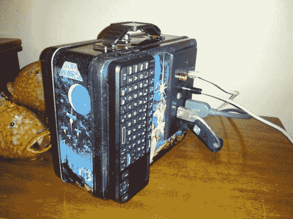

# HTPC 午餐

> 原文：<https://hackaday.com/2014/02/18/htpc-for-lunch/>

如果你渴望一个便携式 HTPC(家庭影院电脑)解决方案，也许[把所有东西都装进一个时尚的迷你饭盒](http://www.instructables.com/id/Portable-XBMC-Lunch-box/)是个不错的选择。[tomhung]想要一种快速简单的方式在他离开家时携带他的媒体，但在一个有意便携的独立外壳中，而*星球大战*饭盒为必要的内脏提供了足够的空间。

在里面，他把 RasPi 和 USB 集线器叠放在一起。每一个都被安装在它自己的由塑料 DVD 盖制成的平台上，并由看起来像廉价塑料笔的外壳雕刻而成的支架隔开。该堆栈还包括一个 250GB 的 2.5 英寸硬盘，为了方便拆卸，[tomhung]只需将其与 velcro 连接即可。电缆经历了小手术，以保持老鼠的巢穴在控制之下，虽然内部可能仍然会引起电缆管理爱好者的畏缩，但盒子的外部清理得很好，便于晚上外出。[tomhung]在午餐盒正面安装一个简单的 6 端口 keystone 墙板，为所有重要的插头提供简单的连接。