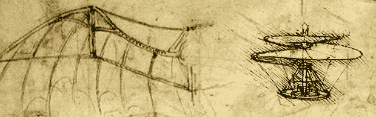

# 人力飞行表演

> 原文：<https://hackaday.com/2013/07/13/human-powered-flight-extravaganza/>

如果你没听说过，西科斯基奖，一项建造人力直升机的航空挑战，可以在三米高空悬停整整六十秒，[已经宣布](http://www.youtube.com/watch?v=syJq10EQkog)。这项难以置信的工程壮举是由 AeroVelo 完成的，同时得到了多伦多大学和许多参与设计和制造旋翼机的公司的大力帮助。这个奖项已经无人问津 30 年了，这并不是因为缺乏尝试；在 20 世纪 80 年代和 90 年代，日本的大学尝试过这一挑战，最近[来自马里兰大学的一个团队尝试了这一挑战](http://hackaday.com/2011/05/10/human-powered-quadcopter-flies-live-tomorrow/)。

但是就人力飞行而言，直升机几乎是最低效的起飞方式。直升机需要动力来提供自己的升力和推力，而飞机只需要产生一些向前的动力。

从 1979 年自行车动力横渡英吉利海峡开始，人力飞行已经走过了漫长的道路，到目前为止，皇家航空学会将举办 2013 年伊卡洛斯杯。这是一场比赛，人力飞机爱好者团队将在测量距离、速度、耐力和着陆准确性的挑战中竞争。

不，这不是达芬奇笔记本里的扑翼飞机，但是人类的胸肌无论如何也没有足够的力量来做这个。

感谢[DainBramage1991]发来这封信。