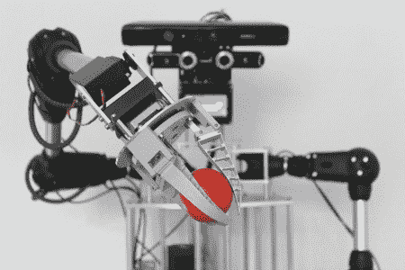

# 仿人机器人与其环境互动

> 原文：<https://hackaday.com/2012/09/10/humanoid-robot-kinects-with-its-enviroment/>

来自德国的[Malte Ahlers]在完成神经生物学博士学位后，决定建造一个人类大小的人形机器人躯干。[Malte]对机器人感兴趣，想向 case 展示他的一些技能。该项目仍处于早期开发阶段，但正如你将在视频中看到的，到目前为止，他已经完成了一个不错的构建。

A1 由一个人大小的躯干和两个手臂组成，每个手臂有五个(或六个，包括手爪)旋转轴，这些旋转轴基于德国 igus.de 公司的 robolink 关节。关节是由步进电机驱动的腱，连接有行星齿轮头。使用他自己建造的实验控制器，[Malte]可以通过监控关节中嵌入的编码器来监控轴的位置。

A1 躯干具有两个自由度的头部，配备了微软 Kinect 传感器和两个罗技 QuickCam Pro 9000 摄像头。利用这种功能，头部可以在空间上“看”和“听”。头部还有用于语音输出的扬声器，可以伴随着液晶屏幕上的动画手势，例如嘴唇运动。双手具有基于 FESTO FinGripper 手指的简单抓握工具，允许拾取各种物品。