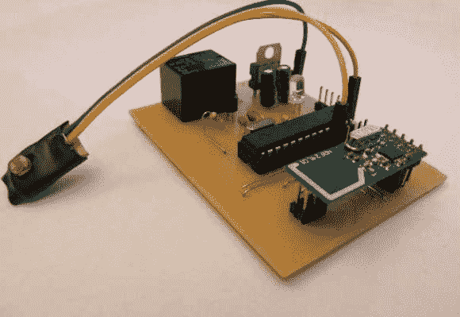

# 一个家庭自动化项目的卑微开端

> 原文：<https://hackaday.com/2013/01/18/humble-beginnings-of-a-home-automation-project/>

这块板是[史蒂文·皮尔森]寻求让他的家自动化的开始。该模块将用于原型项目的其余部分。现在它使用 ATmega328 芯片运行 Arduino 引导程序。这连接到一个机械继电器，我们打赌是电源额定。该模块将通过前景中的无线模块进行无线控制。这是一个 nRF24L01 板，他之所以选择它，是因为它的低价标签约为 1.50 美元。

该系统有很大的扩展空间。你可以看到一个光敏电阻被添加到微控制器的一些分支引脚上。我们猜测[Steven]将使用硬件开发许多不同的功能，并将随着项目的进展设计更多特定任务的模块。

如果你是 PCB 铣削和人口的粉丝，你不会想错过休息后的视频。[Steve]上传了一段整个过程的快动作视频。

[https://www.youtube.com/embed/w4Ypo_4zHvo?version=3&rel=1&showsearch=0&showinfo=1&iv_load_policy=1&fs=1&hl=en-US&autohide=2&wmode=transparent](https://www.youtube.com/embed/w4Ypo_4zHvo?version=3&rel=1&showsearch=0&showinfo=1&iv_load_policy=1&fs=1&hl=en-US&autohide=2&wmode=transparent)