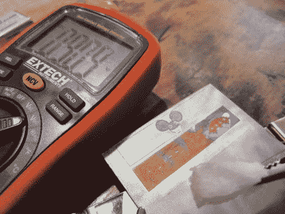

# 我有 99 伏电压，我的阳极氧化完成了！

> 原文：<https://hackaday.com/2012/07/13/i-got-99-volts-and-my-anodizings-done/>

[【potus 31】需要阳极氧化的钛](http://www.nycresistor.com/2012/07/06/9-volt-battery-chain-anodizer/)，但是久经考验的[“浸没”方法](http://hackaday.com/2012/02/26/anodize-titanium-at-home/)并不适合他的尝试。为了创造出他想要的外观，他必须发挥创意，用一些胶带、激光切割机、可乐和一大堆 9v 电池。

他的[一天一枚戒指](http://potus31.blogspot.com/search/label/Ring-A-Day)项目让他根据读者反馈制作定制戒指，最近这些请求让他寻找给金属上色的好方法。阳极氧化钛是一个肯定的赌注，虽然在一个小介质上创造详细的色彩不是一件容易的事情。

[POTUS31]认为他可以通过使用激光切割胶带掩模来逐渐阳极氧化戒指的不同区域，使他能够在进行过程中选择性地氧化他的作品的不同部分。利用可口可乐中普遍存在的磷酸作为氧化剂，以及不断增长的 9 伏电池菊花链，他很快就牢牢掌握了这项技术。正如你在上面的图片中看到的，阳极氧化效果很好，在钛带上产生了生动的颜色，而不需要任何种类的染料。

迄今为止你最喜欢的颜色是什么？你猜对了，99 伏电压下，金属氧化产生的浓郁绿色。

[ [via Make](http://blog.makezine.com/2012/07/12/9-volt-battery-coca-cola-titanium-anodizer)