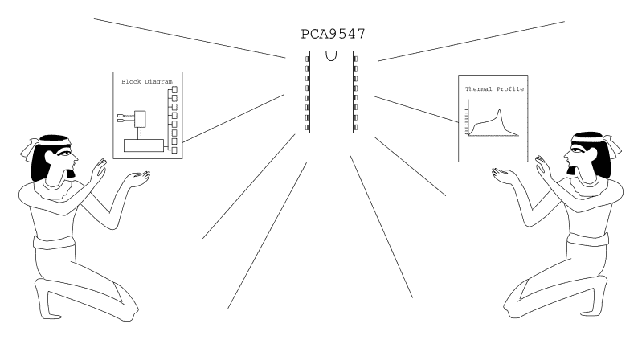
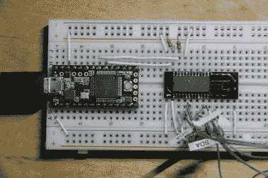
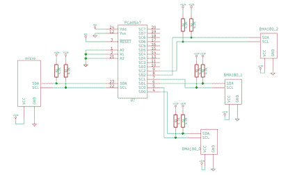

# 更专业的 I2C 公交拆分

> 原文：<https://hackaday.com/2015/08/12/i2c-bus-splitting-with-a-more-professional-touch/>

上周，我报道了[的一些痛苦细节，这是一个有趣的黑客技术，它让我们用一个解复用器将 I C 时钟](http://hackaday.com/2015/07/27/i2c-hacks-how-to-splice-clocks-into-chip-selects/)线分成多个输出，有效地为我们提供了具有相同地址的设备的“芯片选择”。

本周，我认为最好设计一种稍微实用一点的方法来解决与具有相同地址的 I C 设备对话的问题。

事实上，我收集了很多评论，都提到了我用来解决这个问题的同一系列芯片，我很高兴我们在探索设计空间时跳离了同一条线索。

## 回顾前人的工作

在想出一个聪明的方法来拼凑我们自己的解决方案之前，最好看看在我们之前是否有人已经经历了所有的麻烦来解决这个问题。在这种情况下——我们很幸运——我们想要的确切总线分流行为被嵌入到一个分立 IC 中，称为 PCA9547。

值得记住的是，我们的前辈不知疲倦地创造了这样一个商品硅。

[PCA9547](http://www.nxp.com/documents/data_sheet/PCA9547.pdf) (PDF)是一款八路 I C 总线多路复用器，我敢说，它可能是这种情况下最实用的解决方案。该芯片不仅提供 8 条独立总线，还可以连接多达 7 个额外的 PCA9547s，以便与多达 64 个相同的器件进行通信！此外，PCA9547 还具有额外的优势，可以兼容不同总线上的 3.3V 和 5V 逻辑电平器件。最后，与上周的“黑客攻击”相反，每条总线都是双向的，这意味着 PCA9547 完全符合*IC 规范。*

从八条 I2C 总线中选择一条是通过 I2C 总线本身的传输来完成的。值得一提的是，与上周的时钟分离器解决方案相比，这种方法确实引入了少量的延迟。尽管如此，如果您计划从一条总线上顺序读取多个设备，那么尽可能接近每个设备的同时读/写可能不会对您的系统造成限制。

    

用一个 [分线板](http://www.digikey.com/product-detail/en/24-350000-10/A322-ND/123758) 来暴露焊盘，我模拟了一个 quick-n-dirty [Arduino 库](https://github.com/Poofjunior/i2c_demultiplexing_demo/tree/master/pca9547_example/pca9547) 来开始对话，并复制了上周的演示。

令人高兴的是，PCA9547 有一个改变总线地址的单一功能，几乎是一个“正常工作”的嵌入式解决方案。我们可以站在芯片设计师的肩膀上快速完成工作，这绝对令人放心。(他们很可能还做了更多的测试，以确保他们的设备像承诺的那样运行。)就像上周一样，可以在 [Github](https://github.com/Poofjunior/i2c_demultiplexing_demo) 上随意查看演示源代码。

下次再见——干杯！