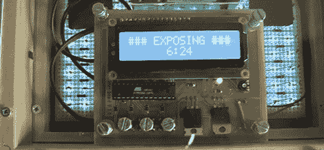

# 宜家提供了一个很棒的紫外线照射箱

> 原文：<https://hackaday.com/2012/11/06/ikea-provides-a-great-uv-exposure-box/>

在家里制作自己的电路板是家庭修补者的最高成就之一，也是一个充满挫折的成就。墨粉转移过程需要小心地剥离照片纸层，并且研磨你自己的电路板是一项复杂的工作。最好的选择之一是使用光敏铜板，但这需要将遮蔽的铜暴露在相当强的紫外光下。紫外线曝光箱是一个很棒的项目，然后，一些东西[Carlo] [就要结束了](http://www.carlolog.net/log/2012/11/making-an-exposure-box-from-scratch-part-two/)。

[Carlo]建造的第一部分包括在一块原板上放置 135 个紫外线发光二极管。这种紫外线光源消耗了惊人的能量；[Carlo]使用 12V 的电源，所以一个旧的工业电源能够提供建造所需的 1.5 安培。

接下来，[卡洛]需要一个定时器来控制他的曝光箱。他选定了一个基于 ATMega8 的设计，用字符 LCD 作为用户界面来控制高压晶体管的开关。几个按钮可以让[Carlo]设置倒计时，之后 led 灯会在设定的时间内亮起。

所有这些都装在一个小盒子里[Carlo],这个盒子是从宜家买来的。这是一个非常有用的构建，从休息后的视频来看，非常容易使用。

[//player.vimeo.com/video/52749351](//player.vimeo.com/video/52749351)