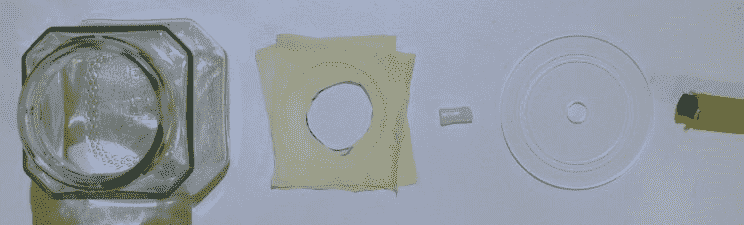

# 在真空罐中捕获的照明

> 原文：<https://hackaday.com/2014/12/02/illumination-captured-in-a-vacuum-jar/>

对世界上不同寻常的事物进行实验是令人敬畏的……尤其是当结果是冒烟的发光等离子体时。对于这个相对简单的项目，[Peter Zotov]以购买他的新真空泵为借口，建造了一个迷你真空室，并展示了他的基于 [mosfet 的 *Gouriet-Clapp 电容三点式振荡器*](http://lab.whitequark.org/notes/2014-11-30/three-point-oscillator/) 对它的影响。

在这种情况下，照明是由 Gouriet-Clapp 振荡器产生的高频电磁场引起的。[Peter]概述了其中一种的构造，由两个不同的缠绕线圈(由涂层导线制成)、一些电容器、一个 mosfet、电位计和散热器组成。当振荡器放置在气体放电管旁边时，它使空间发出与内部压力条件成比例的光。

在他的[气密和几乎无空气的外壳](http://lab.whitequark.org/notes/2014-12-01/coffee-bin-chamber/)中，【Peter】使用一个小玻璃罐和一个乳胶手套作为它和定制切割丙烯酸法兰之间的配件。所有东西都紧密地夹在一起，通过法兰中心插入的真空软管应该可以将空气排除到 100 帕以下。此时，当罐子放在振荡器旁边时，它将发挥它的物理魔力…

[Peter]在他的博客上列出了用于这个项目的材料和图表清单,如果你有兴趣自己看看的话。不可否认，听一听物理学家插话，更清楚地解释一下这个把戏是如何发生的，以及是否有任何风险，会有所帮助。无论如何，这是一个非常有趣的实验。