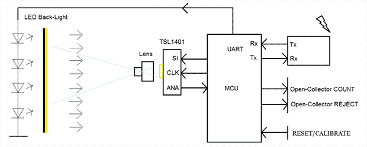

# 用于灌装酒瓶的图像传感器

> 原文：<https://hackaday.com/2014/01/05/image-sensor-for-filling-wine-bottles/>

新西兰的一家葡萄酒装瓶公司与[Boz]取得了联系，以解决一个问题。他们需要一种方法来自动确定酒瓶是否装满。[他发明的](http://rodyne.com/?page_id=38)是一种非常简单但非常有效的灌装量传感器，每小时可以扫描数千个瓶子。

这款酒瓶传感器的构造包含了一些设计决策。[Boz]可以使用 VGA 相机传感器，但鉴于装瓶线的速度(每秒半米)，将所有这些像素推送到计算机并进行实时图像分析将是困难的。[Boz]选定了一个更简单的解决方案——1×128 线性 CCD 模拟图像传感器。通过 PIC 微控制器，该设备可以每秒钟检查多个瓶子，计算瓶子是否装满(或过量灌装)，并向生产线的其余部分发送“通过”或“拒绝”信号。

组装的其余部分相当简单，LED 背光为 CCD 提供照明，蓝牙发射器用于检查机器的设置。在装瓶线上，该设备对深色瓶中的红葡萄酒和绿色瓶中的白葡萄酒都有 99%的准确率。你可以看看这个设备在新西兰装瓶线上的运行情况。

[https://www.youtube.com/embed/GINmkBnqDsw?version=3&rel=1&showsearch=0&showinfo=1&iv_load_policy=1&fs=1&hl=en-US&autohide=2&wmode=transparent](https://www.youtube.com/embed/GINmkBnqDsw?version=3&rel=1&showsearch=0&showinfo=1&iv_load_policy=1&fs=1&hl=en-US&autohide=2&wmode=transparent)

