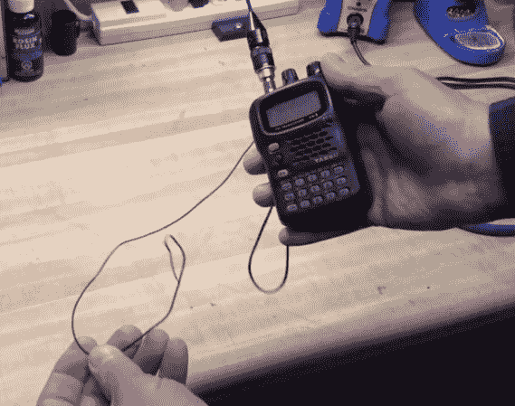

# 增加一根平衡天线来改善你的 HT 业余无线电

> 原文：<https://hackaday.com/2014/02/08/improve-your-ht-ham-radio-by-adding-a-counterpoise-antenna-wire/>

我们发现了一个有趣的提示，可能会提高那些小型平价手持业余无线电的性能，这种无线电被称为“Handy Talky ”,在业余无线电术语中简称为 ht。[RadioHamGuy]发布了一个关于[给 HT](http://www.youtube.com/watch?v=szmQmCn1tH4) 添加地网天线的有趣视频。他声称，通过将四分之一波长单极天线制成临时的偶极天线系统，它将显著提高发射和接收性能。

根据他的指示，你基本上是在天线的外部接地连接或等效的外壳螺丝上添加一根短线，该螺丝与天线的接地端电连接。显然，这可以被称为老虎尾巴，并使它看起来像你的 HT 有尾巴。对于 VHF，您需要构建 11.5 英寸的地网天线；对于 UHF，您需要构建 6.5 英寸的地网天线；对于性能良好的双频带 VHF/UHF 收音机，您需要构建约 19.5 英寸的地网天线。

一般来说，手持无线电设备的地网是你自己的身体，因为你正拿着它。这是因为在正常情况下，你身体的电容是一个很好的平衡。听听其他人对增加地网天线时的性能有何看法会很有意思。

休息之后可以看【RadioHamGuy】多种电台类型的全建造教程视频。

[https://www.youtube.com/embed/szmQmCn1tH4?version=3&rel=1&showsearch=0&showinfo=1&iv_load_policy=1&fs=1&hl=en-US&autohide=2&wmode=transparent](https://www.youtube.com/embed/szmQmCn1tH4?version=3&rel=1&showsearch=0&showinfo=1&iv_load_policy=1&fs=1&hl=en-US&autohide=2&wmode=transparent)