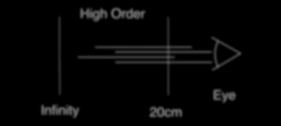

# 用电脑生成的眼镜改善你的视力

> 原文：<https://hackaday.com/2012/07/16/improve-your-vision-with-computer-generated-glasses/>

[熊伟·潘普洛纳]在今年的 SIGGRAPH 上提交了一个项目。这是一个不需要镜片就能矫正视力的硬件[。没错。软件定义的眼镜现在已经存在，尽管这个项目对于日常佩戴来说有点笨重。](http://tailoreddisplays.com/)

[熊伟]等人为这个项目设计了两个版本的硬件。第一个是高分辨率液晶显示器的双栈，而第二个版本是一个透镜覆盖的液晶显示器。利用这种硬件，该团队可以改变整个图像的焦平面，或者只是图像的子集，从而为患有近视、远视、散光、老花眼甚至白内障的任何人提供定制的视力矫正。

随着大量头戴式增强现实平台的出现，如[谷歌的 Project Glass](http://hackaday.com/2012/04/07/googles-project-glass-and-other-head-mounted-displays/) 和一些[视网膜显示器](http://hackaday.com/2012/04/09/projecting-video-directly-onto-the-retina/)，我们可以看到这种软件定义的视力矫正对于使用某种形式视力矫正的 75%的成年人来说*非常*有用。这可能只是创造现实生活中的护目镜[的一小步，但是我们这些戴眼镜的人会尽我们所能。](http://en.memory-alpha.org/wiki/VISOR)

您可以查看。论文的 PDF[这里](http://tailoreddisplays.com/PamplonaTailoringSIGGRAPH2012_hires.pdf)，或者休息后看视频。

[https://player.vimeo.com/video/41664603](https://player.vimeo.com/video/41664603)