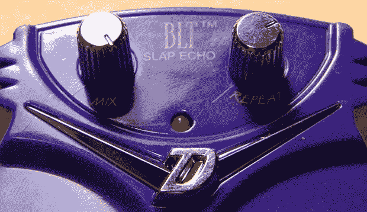

# 改进廉价的吉他踏板

> 原文：<https://hackaday.com/2013/11/29/improving-a-cheap-guitar-pedal/>

如果有什么东西不适合你的需求，那就换一个。这是我们生活的座右铭，看起来当[道格]改装了一个廉价的效果踏板时，他也遵循了同样的信条。

[Doug]的烙铁的受害者是 Danelectro BLT Slap Echo——Danelectro 的迷你“食品命名”踏板系列中的一款小型廉价踏板。股票，这个踏板的拍打回声设置为固定的时间量。[道格]国防部改变了这一点。

mod 包括拆焊单个 SMD 电阻，并用一个 50k 的 pot(Doug)替换它。在将锅安装在两个枪托旋钮之间后，新的和改进的踏板具有可变长度的回声。这个踏板还可以有更多的变化——改变滤波器上的一些电阻以获得更好的声音，或者甚至将 rate pot 连接到 wah 风格的摇杆踏板以实现一些不稳定的 Echoplex 或空间回声动作。

你可以点击这里查看道格的照片库。