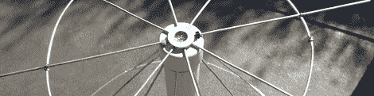

# 用几根线改进软件无线电

> 原文：<https://hackaday.com/2012/05/14/improving-a-software-defined-radio-with-a-few-bits-of-wire/>

被软件定义无线电领域的最新进展所打动，[Jason]拿起一个 20 美元的 USB 电视调谐器加密狗来检查他的本地广播。不幸的是，小 USB 加密狗附带的天线接收广播电视以外的任何信号都很糟糕。[杰森]想改善他的接收效果，所以他找来一些电线，自己做了一个盘锥天线。

[discone 天线](http://en.wikipedia.org/wiki/Discone_antenna)非常适合[Jason]的设置——如果构造得当，它能够接收 RTL-SDR 加密狗能够读取的整个 64 至 1700 MHz 频段。为了建造他的天线，[Jason]查阅了[VE3SQB]的[天线设计程序清单](http://www.ve3sqb.com/)，得到了他的天线的尺寸，并着手将电线连接到 PVC 管上。

该天线是对电视调谐器加密狗随附的普通天线的重大改进。在后院的远端安装了盘锥后，[杰森]开始从过往飞机的应答机上接收到一些信号。