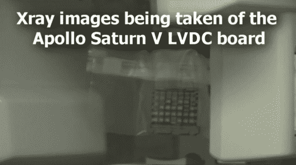

# 深入查看土星五号火箭的 LVCD 板

> 原文：<https://hackaday.com/2013/01/09/in-depth-look-at-an-lvcd-board-from-a-saturn-v-rocket/>

当[看着这块来自太空竞赛](http://www.frantone.com/designwritings/design_writings.html#saturnV)的老式电路板时，加入【Fran】的行列，她戴上了一顶电子考古学家的帽子。作为她个人收藏的一部分，她不知何故获得了一个土星五号火箭的运载火箭数字计算机板。这个特殊的装置从未被使用过。但是如果阿波罗计划继续的话，那就有可能了。

[Fran]对这块特殊的电路板非常着迷，因为她相信它是现代数字电路设计和布局的先驱。因为给电路板布线是她谋生的一部分，所以你可以理解为什么这对她很重要。此外，谁不为太空项目的实际硬件感到兴奋呢？休息之后我们嵌入了她的两段视频。在第一个视频中，她向镜头展示了这个组件，并简单介绍了一下。但是第二段视频显示她[去牙医诊所拍 x 光片](http://www.frantone.com/designwritings/design_writings.html#xray)。上面的图像是一个旋转的 x 光机，但看起来最好的图像来自于手持枪。他们获得了一些出色的走线图像，以及电路板上的 TTL 元件。

看一看棋盘本身

[https://www.youtube.com/embed/J0ggqY7vnAw?version=3&rel=1&showsearch=0&showinfo=1&iv_load_policy=1&fs=1&hl=en-US&autohide=2&wmode=transparent](https://www.youtube.com/embed/J0ggqY7vnAw?version=3&rel=1&showsearch=0&showinfo=1&iv_load_policy=1&fs=1&hl=en-US&autohide=2&wmode=transparent)

用 x 光机分析 LVDC

[https://www.youtube.com/embed/zWGpF05zhdU?version=3&rel=1&showsearch=0&showinfo=1&iv_load_policy=1&fs=1&hl=en-US&autohide=2&wmode=transparent](https://www.youtube.com/embed/zWGpF05zhdU?version=3&rel=1&showsearch=0&showinfo=1&iv_load_policy=1&fs=1&hl=en-US&autohide=2&wmode=transparent)