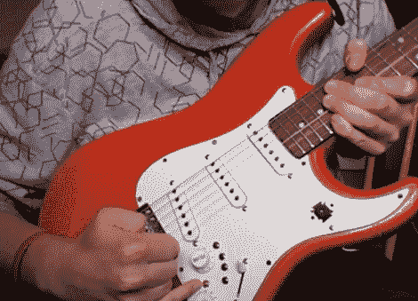

# 不显眼的吉他 Hack 给 Max/MSP 增加了不少控制力

> 原文：<https://hackaday.com/2012/04/30/inconspicuous-guitar-hack-adds-a-lot-of-control-to-maxmsp/>

[Sam]正在攻读他的交互技术学位，他对这把吉他做了一些改动，作为一个班级项目。它看起来没有太大的不同，但仔细观察会发现一些额外的按钮和一个相机模块。他实际上在吉他上加了一个 Wii 遥控器，用来控制 Max/MSP。

他的小手指正指着其中一个按钮。那个是红色的，可以触发 Wii 遥控器的蓝牙同步功能。其他四个按钮连接到向上、向下、A 和 B 按钮。在广告之后的视频中，[Sam]谈到了用于将遥控器连接到电脑的 Max/MSP 前端。一旦建立了通信，加速度计传感器数据将持续流入软件，其他四个按钮用于控制补丁。

安装在吉他上的摄像头模块可以用来传输视频，但似乎对声音没有影响。事实上，实时视频输入可以与波形生成混合在一起。像音量这样的声音特征会影响两个视频信号之间的交叉衰落。[Sam]谈到了这一功能，但当播放演示在剪辑的 6:10 开始时，我们在投影屏幕上没有看到任何现场视频。

[https://www.youtube.com/embed/XXSMVKsNl4Q?version=3&rel=1&showsearch=0&showinfo=1&iv_load_policy=1&fs=1&hl=en-US&autohide=2&wmode=transparent](https://www.youtube.com/embed/XXSMVKsNl4Q?version=3&rel=1&showsearch=0&showinfo=1&iv_load_policy=1&fs=1&hl=en-US&autohide=2&wmode=transparent)