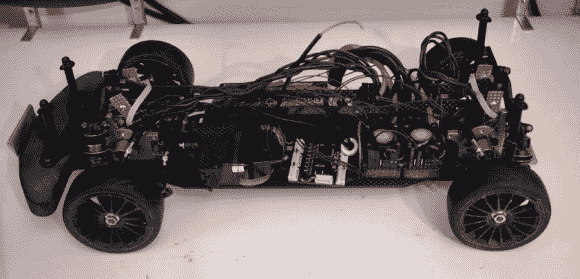

# 独立轮驱动遥控汽车

> 原文：<https://hackaday.com/2014/07/12/independent-wheel-drive-rc-car/>

上图看起来像一辆标准的四轮驱动(4WD)旅行车。当你走近一看，一些奇怪的事情开始出现。马达在哪里？4 个电子速度控制？这是怎么回事？[HammerFET]创造了这辆[独立驱动遥控车](https://www.youtube.com/watch?v=ET1HEyqEQJQ) (YouTube 链接)作为他的控制系统的研究平台。这辆车作为标准的[舒马赫 Mi5](http://www.racing-cars.com/pp/Car_Showroom/Mi5.html)1/10 比例旅行车开始了它的生命。[HammerFET]拆除了整个驱动系统。电机、差速器、皮带传动装置和电子稳定控制系统都是一堆废弃的硬件。

他用安装在底盘中心线上的 4 个 Turnigy 无刷 outrunner 电机取代了驱动系统。为了将所有的东西组装在一起，他必须用不锈钢 3D 打印出新的驱动杯。军情五处的化学气相沉积传动轴不得不削减，新的碳纤维悬挂塔不得不设计和削减。

真正的魔力在于[HammerFET 的]定制控制板。他使用的是 STM32F4 ARM 处理器和 InvenSense MPU-6050 IMU，无人机飞行员已经熟悉并喜欢上了这两个组件。安装在每个电机上方的霍尔效应传感器会跟踪车轮速度，就像全尺寸汽车上的 ABS 环一样。

[HammerFET 的]软件是用 MATLAB 和 SimuLink 创建的。他使用 SimuLink 的嵌入式编码器插件将他的模型导出到 C 语言，直接在他的板上运行。肯定是昂贵的软件包，但它们确实使测试控制算法简单得多。[HammerFET 的] [代码可在 Github](https://github.com/hammerfet/AelithController) 上获得。

由于一切都由软件控制，改变汽车的驱动系统就像调整代码中的几个值一样简单。前后动力偏移很容易改变。从一个锁定的线轴到一个开放的差速器就像从 0 到 1 改变一个值一样简单。将微分值推过 1 实际上是过度驱动微分。在转弯时，外侧车轮的驱动速度会比机械差速器快，而内侧车轮的速度会慢下来。漂流的粉丝会喜欢这个设定的！

[HammerFET]仍在开发他的软件，他希望实现电子[扭矩矢量](http://en.wikipedia.org/wiki/Torque_vectoring)。感兴趣吗？查看他的 [Reddit 帖子](http://www.reddit.com/r/electronics/comments/2aaccd/my_control_project_1kw_rc_car_with_fully/)上的对话。

[https://www.youtube.com/embed/ET1HEyqEQJQ?version=3&rel=1&showsearch=0&showinfo=1&iv_load_policy=1&fs=1&hl=en-US&autohide=2&wmode=transparent](https://www.youtube.com/embed/ET1HEyqEQJQ?version=3&rel=1&showsearch=0&showinfo=1&iv_load_policy=1&fs=1&hl=en-US&autohide=2&wmode=transparent)