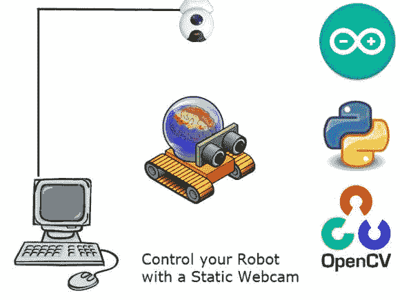

# 廉价的机器人跟踪系统是群体就绪

> 原文：<https://hackaday.com/2013/10/23/inexpensive-robot-tracking-system-is-swarm-ready/>

【拉德维恩】想出了一种廉价的方法，用静态网络摄像头从远程电脑上控制机器人。受蜂拥而至的机器人视频的启发，比如来自[宾夕法尼亚大学 Grasp 实验室](http://hackaday.com/2011/07/03/robotic-schadenfreude-quadrotor-blooper-reel/)，【拉德维恩】想要建立自己的基于静态摄像机的系统。他还设法创造了一种我们见过的更为折衷的乐器。你不会经常在项目指令中发现[机器人自杀的伪代码](http://www.youtube.com/watch?v=X6PaLiIl6MA)。

许多动作捕捉系统都使用固定摄像机，例如众多电影、游戏和动画工作室使用的 [Vicon](http://www.vicon.com/) 系统。维康和类似的系统花费数万美元。这有点超出了拉德维恩的预算。他开始从零开始建立自己的系统。第一步是最难的——获得他妻子的许可，在天花板上安装一个摄像头。解决了这个问题后，[Ladvien]开始使用 openCV 和 python。他创造了[霸王](http://letsmakerobots.com/node/38208)，他的网络摄像头视觉和控制系统。一个没有任何东西可以控制的视觉系统会相当无聊，所以【拉德维恩】创造了 [DotMuncher](http://letsmakerobots.com/node/38203) ，霸王的无线电控制机器人奴隶。

基本的处理系统相当简单。DotMuncher 在船上携带了一个磁力计，用来向霸王发送航向信息。霸王是预先校准从磁北到“视频游戏北”(对屏幕顶部)的偏移。然后霸王使用 openCV 的颜色检测在当前场景中找到 DotMuncher。霸王终于在屏幕上生成了一个虚拟的“点”,并指示 DotMuncher 向它驶去。当机器人到达那个点时，它被认为被咀嚼了，一个新的点产生了。

整个系统是[拉德维恩]计划的未来 swarm 项目的概念验证。他希望在今年年底前让[自主机器人标签](http://www.youtube.com/watch?v=jiU4ZEwfStc&feature)投入使用。我们等不及要看那部电影了。

[https://www.youtube.com/embed/uqnNYnS66do?version=3&rel=1&showsearch=0&showinfo=1&iv_load_policy=1&fs=1&hl=en-US&autohide=2&wmode=transparent](https://www.youtube.com/embed/uqnNYnS66do?version=3&rel=1&showsearch=0&showinfo=1&iv_load_policy=1&fs=1&hl=en-US&autohide=2&wmode=transparent)