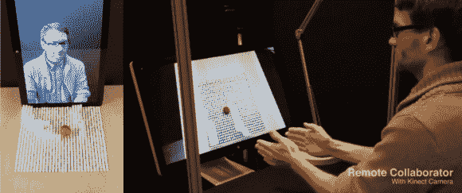

# 通知变形表变得更加互动

> 原文：<https://hackaday.com/2013/11/13/inform-the-morphing-table-gets-even-more-interactive/>

还记得上周 inFORM 上的帖子吗，[麻省理工学院的变形表？](http://hackaday.com/2013/11/07/inform-mits-morphing-table/)嗯，他们刚刚发布了一个新的视频，展示了它能做什么，[这是非常令人印象深刻的。](http://www.youtube.com/watch?v=ouP9xNujkNo)

新的设置有两个独立的界面，他们增加了一个显示器，这样你就可以看到谁在操纵表面。这为触觉数字体验带来了全新的可能性。inFORM 还在表面上安装了一个投影仪，可以从视觉和物理上看到从另一面显示的对象——他们使用了一个打开一本书并在表面上显示其页面的例子。为了追踪手部动作，他们使用了一台普通的老式微软 Kinect，效果非常好。他们还将桌子展示为一个独立的单元，一个交互式的桌子——现在他们需要做的就是将像素变小…

休息过后，留下来看看这种新的触觉数字界面的可能性的更多令人敬畏的例子。在视频的结尾也有一些很棒的剪辑，展示了使其全部工作的复杂的联动系统。

[https://www.youtube.com/embed/ouP9xNujkNo?version=3&rel=1&showsearch=0&showinfo=1&iv_load_policy=1&fs=1&hl=en-US&autohide=2&wmode=transparent](https://www.youtube.com/embed/ouP9xNujkNo?version=3&rel=1&showsearch=0&showinfo=1&iv_load_policy=1&fs=1&hl=en-US&autohide=2&wmode=transparent)

[通过 [Gizmodo](http://sploid.gizmodo.com/this-video-of-the-magic-morphing-table-is-awesome-1463167945)