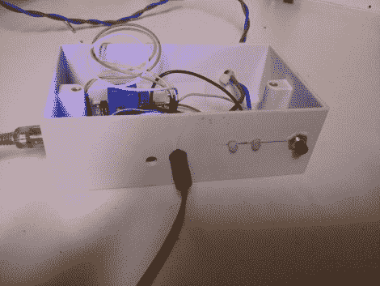

# 红外遥控烟花点火器

> 原文：<https://hackaday.com/2014/06/21/infrared-controlled-remote-firework-igniter/>

随着独立日即将到来，美国黑客可能会发现自己以独立的名义搞破坏。这很有趣，但也很危险。标准的点火方法“用打火机快速逃离”并不完全安全。与其用老方法点燃你的烟花，为什么不效仿[无脸科技]的例子，制造你自己的红外线控制的遥控点火器？

第一步是决定如何点燃烟火导火线。[匿名技术]已经看到其他人使用汽车点烟器来达到这个目的，他决定跟随他们的脚步。他首先从自己的车里取出打火机，并把它拆开。这次攻击只需要一个组件。主要的加热元件是一个末端带有“茎”的小圆盘。如果你把 12V 的电压加在电极上，把圆盘的外缘接地，点火器会很快变热。

[Facelesstech]最初认为他可以将一些电线焊接到设备上。然而，加热元件变得如此之热，以至于每次打开它时焊料都会熔化。然后，他发挥创意，在一小块木头上钻了一个孔，以安装加热元件。这种元件用螺栓固定在木头上，螺栓被用作电源的导体。

加热元件通过 12V 继电器供电。继电器由 Arduino Nano 控制。Nano 允许两种操作模式。在第一种模式下，你只需按下一个按钮，Nano 就会启动一个五秒钟的计时器。这个想法是为了在烟火点燃之前给你足够的时间跑到一个安全的距离。这与老式方法没有太大区别，但它确实给了你一个稍微延长的保险丝。第二种模式是项目真正出彩的地方。Nano 还连接了一个红外接收器。这使得[无脸科技]可以按下旧电视红外遥控器上的按钮来激活点火器。这是一个聪明的解决方案，因为它允许您到达一个安全的距离，而不必运行很长的电线。而且简单又便宜。一定要看下面系统的视频测试。

[https://www.youtube.com/embed/0o56RdHqf0s?version=3&rel=1&showsearch=0&showinfo=1&iv_load_policy=1&fs=1&hl=en-US&autohide=2&wmode=transparent](https://www.youtube.com/embed/0o56RdHqf0s?version=3&rel=1&showsearch=0&showinfo=1&iv_load_policy=1&fs=1&hl=en-US&autohide=2&wmode=transparent)

[谢谢戴尔]