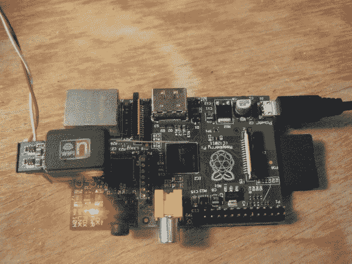

# 给树莓派的 WiFi 加密狗注入能量

> 原文：<https://hackaday.com/2012/11/27/injecting-power-into-a-wifi-dongle-for-the-raspberry-pi/>

所以树莓派有时没有足够的电力来运行耗电的 USB 加密狗。最常见的问题是 WiFi 适配器。长期以来，解决方案一直是使用一个带电源的 USB 集线器，但[迈克·沃斯]不想占用那么多额外的空间。他想出的解决方案是[直接向电子狗本身注入能量](http://www.mike-worth.com/2012/11/26/adding-wi-fi-to-a-raspberry-pi-without-a-powered-hub/)。

从侧面出来的红色和白色电线提供 5V 电源。这来自为 RPi 板本身供电的同一 USB 主电源适配器。为了将电线连接到加密狗，他用一些条形板和加密狗的屏蔽做了一个适配器。条形板的末端伸出屏蔽层足够远，他可以焊接一些导线，然后将这些导线焊接到加密狗 PCB 上的迹线上。

你只要插上这个就可以开始工作了。但是当他在做的时候[迈克]增加了一个简易天线以获得更好的接收效果。这与我们在这篇链接文章中看到的他用于蓝牙加密狗[的黑客攻击类型相同。](http://hackaday.com/2012/05/21/hackaday-links-may-21-2012/)