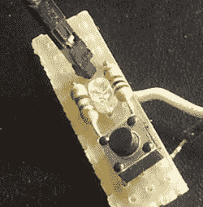

# 单个引脚上的输入和输出

> 原文：<https://hackaday.com/2014/05/08/input-and-output-on-a-single-pin/>

[埃米利奥]有一个树莓 Pi，有几个传感器完全无头运行。这是收集数据并将其发布到互联网上的一种很好的方式，但在极少数情况下，当 Pi 需要关闭进行维护时，[Emilio]需要连接显示器、键盘和鼠标。当一个简单的按钮和指示灯 LED 就足够了时，这不是一个完美的解决方案。添加一个简单的按钮和 LED 组合有一个问题:在设置中只有一个 GPIO 引脚可用。几个电阻解决不了的问题。

在一块 perfboard 上连接了一个非常简单的电路后，[Emilio]实现了他的设计目标，即能够判断 Pi 是否正在运行，并仅使用一个 GPIO 引脚为其提供一个软件复位按钮。该电路只需要两个电阻，让一切运行的软件(一个简单的 Python 脚本)在输入和输出之间切换引脚，检查按钮是否被按住 5 秒钟。如果是，Raspi 会关闭电源进行[Emilio]的日常维护。