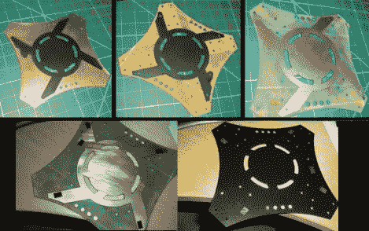

# 将电源总线集成到四轴飞行器框架中

> 原文：<https://hackaday.com/2012/09/17/integrating-a-power-bus-into-a-quadcopter-frame/>

在飞行器上工作时，重量总是一个需要考虑的因素。[Brendan]找到了一种方法来摆脱他的四轴飞行器上的线束，简化了组装，同时减轻了负载。他通过将电源总线整合到汽车框架中来做到这一点。

他从一些覆铜板开始。因为基板是一个结构组件，他不想使用数控铣床来做蚀刻，因为它也去除了一点，不仅仅是铜。在用磨切出形状并钻孔后，他在木板上涂上一层黑色的油漆。这充当了抗蚀剂，他将抗蚀剂通过 50W 激光雕刻机去除油漆，露出他想要蚀刻的区域。蚀刻后，他去除了剩余的抗蚀剂，并用小矩形的绝缘胶带遮住了焊盘。这保护了焊盘免受他用来绝缘铜的卡车底板衬垫油漆的影响。他说这种技术非常有效，并计划在未来的所有版本中使用这种技术。