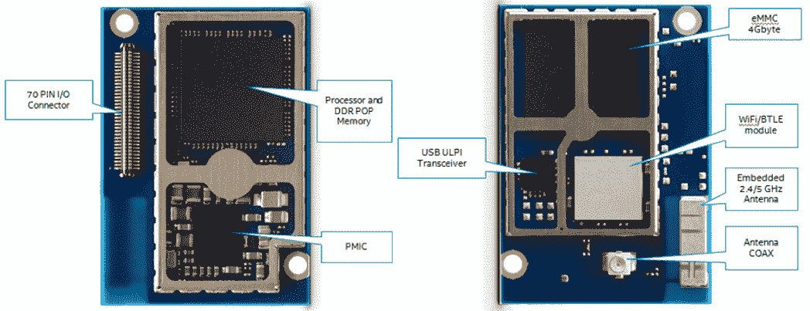

# 英特尔发布比 SD 卡稍大的电脑 Edison

> 原文：<https://hackaday.com/2014/09/09/intel-releases-edison-a-computer-slightly-larger-than-an-sd-card/>

今年年初宣布，英特尔的爱迪生是芯片制造商进军低功耗、高性能计算领域的最新尝试。最初的设想是将一台 x86 计算机塞进 SD 卡中，这个用于可穿戴设备、消费电子设计师和物联网的微型平台在过去几个月里显然已经进行了几次重新设计。[现在，英特尔终于向世界发布了它](http://www.intel.com/content/www/us/en/do-it-yourself/edison.html)。它仍然很小，仍然基于 x86 架构，而且它将成为一个非常有趣的平台。

爱迪生的主要特点当然是英特尔 CPU。这是一款 22 纳米的 SoC，双核运行频率为 500 MHz。与其他许多物联网和微型设备不同，这款设备中的芯片 Atom Z34XX 采用 x86 架构。此外，还配备了 4GB eMMC 闪存和 1gb DDR 3。这个微型模块中还包括一个英特尔 Quark 微控制器，与英特尔 Galileo T1 中的微控制器相同，运行频率为 100 MHz。最精彩的部分？爱迪生的零售价约为 50 美元。这是一个占用空间很小的双核 x86 平台，价格仅比树莓派高几美元。

当英特尔爱迪生第一次宣布 T1 时，人们猜测它将会采用 SD 卡的形式。事实并非如此。相反，爱迪生的尺寸为 35.5 毫米 x 25.0 毫米；仅仅比 SD 卡大一点点。抛弃这种外形的想法是一个很好的想法——英特尔没有局限于 SD 卡和平台上的九个引脚，如[电动 Imp](http://hackaday.com/2012/09/04/hands-on-with-the-electric-imp/) ，而是使用 70 引脚连接器来拆分一堆引脚，包括一个 SD 卡接口、两个 UARTs、两个 ic 总线、带两个芯片选择的 SPI、I . S、十二个 GPIOs(其中四个具有 PWM 功能)和一个 USB 2.0 OTG 控制器。在这个小小的板上还有一对无线电模块，使它能够支持 802.11 a/b/g/n 和蓝牙 4.0。

Edison 将支持 Yocto Linux 1.6 开箱即用，但因为这是一个 x86 架构，所以有一个完整的 Linux 发行版也将在这个小小的板上运行。从理论上讲，在这个模块上运行一个版本的 Windows 是可能的，但是这就产生了一个问题，为什么有人想要这样做。

第一轮 Edison 模块将用于提供基本功能、焊点、电池充电器电源输入和两个 USB 端口(一个 OTG 端口)的小型分线板，或者用于 Arduino 的更大的 Edison 板，包括熟悉的 Arduino 引脚排列和一切分线点。英特尔的人是一群慷慨的人，为了努力将这些模块放入下一代互联网产品中，[已经为 70 引脚接头提供了 Mouser 和 Digikey 零件号](https://communities.intel.com/docs/DOC-23161)(数量 1 约为 0.70 美元)。如果你想创建自己的分线板或在产品设计中包含爱迪生，爱迪生让这变得容易。

没有消息说爱迪生将在何时何地上市。不到两周的时间，英特尔的人将在纽约的 Maker Faire 上展示，我们已经有了我们的媒体证书。我们到时候一定会拿到手的。当我在维加斯参加 Defcon 的时候，我确实瞥了一眼爱迪生号，但是除了它在 8 月份存在的事实之外，我没有什么可以写的关于那次经历。

*更新:你可以在[Make](http://www.makershed.com/products/intel-edison-kit-for-arduino)(107 美元，带 Arduino 突破)和 [Sparkfun](https://www.sparkfun.com/products/13024) ( ~~链接到本次更新~~没关系，Sparkfun 有一大堆为爱迪生制作的主板。很酷)*