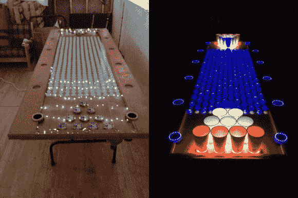

# 交互式 LED 啤酒乒乓桌的功能比你摇一根棍子还多

> 原文：<https://hackaday.com/2014/04/25/interactive-led-beer-pong-table-has-more-features-than-you-can-shake-a-stick-at/>

天啊。这款[交互式 LED 啤酒乒乓桌](http://www.instructables.com/id/Interactive-LED-Beer-Pong-Table)的细节和功能绝对令人难以置信。

该桌子有 384 个独立控制的 RGB LEDs，覆盖有 2 ' x 8 '的 Lexan 板以防止溢出。每个杯架(pod)包含额外的 4 个 RGB LEDs 和一个红外传感器，可以检测杯子是否在适当的位置-如果杯子被移走，红外传感器会在桌子中间的 32 x 12 LED 网格或其他 pod 上触发动画。

外侧边缘的 led 环充当 VU 米，以不同的动画模式随着音乐跳动。真正令人印象深刻的是，[杰夫]还包括一个乒乓球垫圈——一个蓄水池连接在桌子下面两端的两个 LED 环之间。当你把球放入其中一个时，它会被吸到下面，然后从另一边干净地弹出来！

你真的应该看看这个东西的视频。

[https://www.youtube.com/embed/_OS11MW9bxU?version=3&rel=1&showsearch=0&showinfo=1&iv_load_policy=1&fs=1&hl=en-US&autohide=2&wmode=transparent](https://www.youtube.com/embed/_OS11MW9bxU?version=3&rel=1&showsearch=0&showinfo=1&iv_load_policy=1&fs=1&hl=en-US&autohide=2&wmode=transparent)

哦，如果你不知道什么是啤酒乒乓桌… [这里是规则](http://www.bpong.com/beer-pong-rules/)。基本的前提是你试着把你的乒乓球扔进对方的杯子里——如果你成功了，他们必须喝掉那个杯子并把它从桌子上拿走。谁沉的杯子最多谁就赢。

在之前，我们已经[覆盖了](http://hackaday.com/2012/09/28/fancy-beer-pong-table-cleans-your-balls/)许多[啤酒桌球](http://hackaday.com/2012/09/06/electronic-beer-pong-removes-beer-from-the-equation/)桌子[，但是看起来真的是【杰夫】拿走了这块蛋糕！](http://hackaday.com/2009/12/15/interactive-beer-pong-table/)