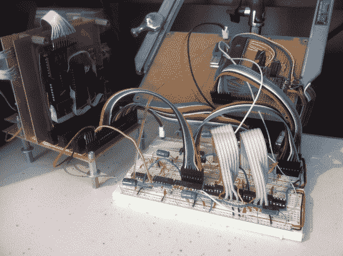

# 连接图形处理器和中央处理器

> 原文：<https://hackaday.com/2012/12/26/interfacing-a-gpu-with-a-cpu/>

[Quinn Dunki]通过将她的 GPU 与 CPU 连接起来，完成了几个月的工作。这是她 Veronica 项目的重点之一，该项目旨在从头开始建造一台计算机。

我们已经从她那里看到了很多关于 AVR 驱动的 GPU 的帖子。到目前为止，该组件的开发一直与以 6502 为中心的 CPU(T3)分开进行。但是把它们放在一起绝不是小事。当从外部组件写入 VRAM 时，开发 GPU 时需要考虑的重要时序问题变得更加棘手。她的第一个想法是在 CPU 和 GPU 之间共享一部分外部 RAM，作为将渲染命令从一个推到另一个的方式。事实证明，这在时序和 AVR 芯片上可用的引脚数量上都很麻烦。她最终使用了 AVR 芯片上的虚拟寄存器，可以异步接收来自 CPU 的命令。时序规定这些命令只能在垂直消隐期间写入，因此该虚拟寄存器也充当状态寄存器，让 CPU 知道何时可以发送下一个命令。

她的帖子充满了设计背后的理论，示波器上的时序测试，以及一个相当吓人的原理图。但最重要的部分是展示她最终成功的视频。