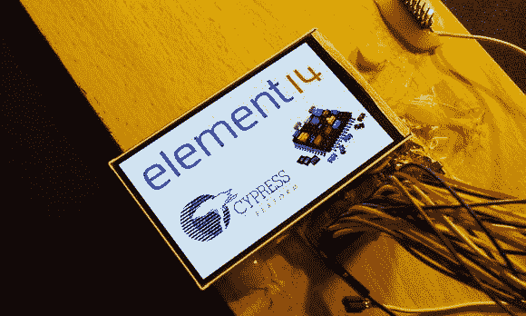

# 与 HTC Desire 显示器及其触摸屏接口

> 原文：<https://hackaday.com/2014/01/04/interfacing-with-the-htc-desire-display-and-its-touch-panel/>

[Linas]去年提交给 Cypress Smarter Life Challenge 的部分内容涉及使用 HTC Desire 显示器及其触摸屏。这款手机包括一个全彩色[有源矩阵有机发光二极管](http://en.wikipedia.org/wiki/Active-matrix_OLED) (AMOLED)显示屏，对角线为 3.7 英寸，分辨率为 480×800，像素密度为 252 像素。使用 MSO2024B 示波器，[Linas]最初通过嗅探 I2C 信号开始了他的触摸屏冒险。由于提取数据需要一些数学知识，他后来找到了 HTC Desire 源代码，并将其包含在他的 STM32F429 中(逆向工程就这么多了！).

在花了很多时间寻找 AMOLED 显示屏和控制器数据表后，[Linas]向一家公司付费，以获得他需要的资源。他制作了一个定制的 PCB，为显示器提供所需的电压，并提供了一个 0.1 英寸的连接器与之接口。RGB565 接口用于与屏幕通信，因此 1600 万色中只有 65k 被使用。您可以下载[Linas]文章中的所有程序文件和数据表。