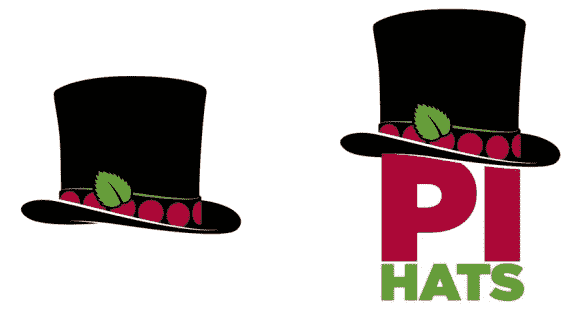

# 每天介绍帽子！当然不要和真实的 HaD 混淆…

> 原文：<https://hackaday.com/2014/08/22/introducing-hat-a-day-not-to-be-confused-with-the-real-had-of-course/>

随着 Raspberry Pi B+型号的发布，出现了大量额外的 GPIO 连接器，实际上多达 40 个——几乎是原始 B 型号的两倍！一顶帽子代表附在顶部的硬件，Adafruit 每天都试图创造一顶新帽子来庆祝。

[帽子](http://www.raspberrypi.org/introducing-raspberry-pi-hats/)是一个 65x56mm 毫米的矩形板，带有用于 Raspberry Pi B+的安装孔和 40 引脚 GPIO 接头。这本身听起来并不特别，但其中两个接头引脚是为一个特殊的自动配置系统保留的，该系统允许您的 Pi 具有自动 GPIO 和驱动程序设置！现在我们正在谈话！

到目前为止，Adafruit 已经制作了几顶原型帽子，包括 Perma-proto 帽子、GPS 帽子、TFT 帽子、Arcade 帽子，甚至还有伺服帽子。但是他们想要更多！我们认为他们在一天一个的记录上出了差错…

我们很高兴看到更多与 B+集成的项目，因为它对附加硬件比原始硬件更友好——你希望看到什么样的硬件形式？你喜欢帽子这个主意吗？