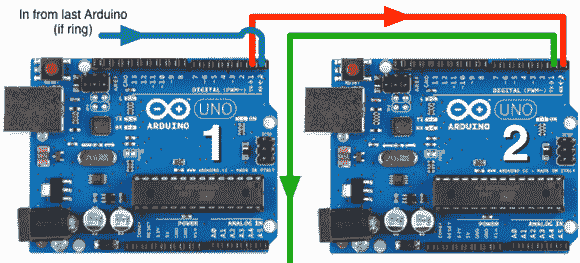

# 为许多 Arduinos 发明网络协议

> 原文：<https://hackaday.com/2012/12/03/inventing-networking-protocols-for-dozens-of-arduinos/>

当你不想使用 I2C 或 SPI，而 MIDI 和 DMX 已经过时时，[Scott]出现并发明了一个非常奇怪的网络协议，它只是用串行连接将几个 Arduinos 串联在一起。

虽然看起来很奇怪，但这个网络协议实际上很有意义。[Scott]正在按照迪士尼幻想工程师的思路制作一个电子鸟舍,并且需要在不消耗宝贵的 IO 引脚的情况下将一大堆 Arduinos 联网。

网络堆栈[Scott]通过简单地将几个电路板菊花链在一起，利用每个 Arduino 中的硬件 UART。通过在链的开始添加 FTDI 分支，[Scott]可以直接从终端控制几十个 Arduinos

[Scott]没有在这个项目中使用现成的 Arduino——几个月前[他在工作中翻垃圾箱时发现了 100 个 Arduino 兼容的步进电机控制器](http://hackaday.com/2012/11/06/dumpster-diving-nets-100-arduino-powered-motor-controllers/),这给他提供了足够多的节点来设计一些非常疯狂的网络协议。这是对他手头硬件的一个很好的利用，也是一个非常聪明的同时控制几十个微控制器的解决方案。

休息之后请欣赏[Scott]的演示。

[https://www.youtube.com/embed/GFqzgdNSR4s?version=3&rel=1&showsearch=0&showinfo=1&iv_load_policy=1&fs=1&hl=en-US&autohide=2&wmode=transparent](https://www.youtube.com/embed/GFqzgdNSR4s?version=3&rel=1&showsearch=0&showinfo=1&iv_load_policy=1&fs=1&hl=en-US&autohide=2&wmode=transparent)