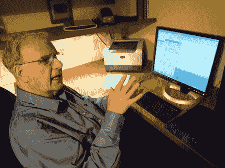

# 555 计时器的发明者去世

> 原文：<https://hackaday.com/2012/08/17/inventor-of-the-555-timer-passes-away/>

2012 年 8 月 15 日，有消息称 555 计时器的[创造者【Hanz Camenzind】已经去世](http://www.eetimes.com/electronics-news/4394166/Hans-Camenzind-dies)。我们都很熟悉 555 timer，但你们很多人可能不知道【Hanz】还创造了第一个 D 类放大器。事实上，他拥有 20 多项专利[和几本书](http://www.designinganalogchips.com)。

他身后留下了妻子、女儿和三个儿子。