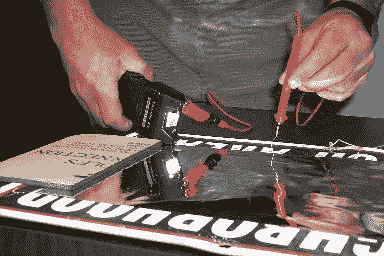

# 爱荷华法医选择 CSI 风格的黑客来节省他们的预算

> 原文：<https://hackaday.com/2014/01/29/iowa-forensics-opts-for-a-csi-style-hack-to-save-their-budget/>

有一种非常有效的方法可以从现场或实验室提取布满灰尘的指纹。它被称为静电灰尘指纹提取器——但你可以想象，从法医用品店买它是相当贵的。国际身份识别协会爱荷华分部的 Bradley VanZee 意识到这是一个多么简单的工具，他花了 50 多美元制作了自己的工具。

但首先，它是如何工作的？静电印刷提升是一种非破坏性的过程，您可以在一张“提升膜”上形成静电场，吸引灰尘颗粒粘附在膜上。它能够恢复多孔和非多孔表面的压痕——甚至是肉眼不可见的压痕。

该工具的商业版本成本高达 600-800 美元+升降膜。他们意识到的第一个诀窍是，不使用专有的升降膜，而是使用车窗着色也同样有效！第二个黑客更聪明——使用 80，000 伏的 tazor、一些电线和一些锡纸，你可以创建自己版本的工具。铝箔起着接地的作用，你要检查的物体就夹在它和升降膜之间。将 tazor 的一个电极放在箔片上，您可以在远处使用另一个电极追踪薄膜，这将在薄膜中感应出静电电荷，吸引并捕获灰尘指纹。让静电放电，并将胶片存放在安全的地方，以便以后进行数字化处理！

很明显，这只对扁平的物体有效，但这仍然是一个绝妙的技巧——尤其是为了节省你的预算！

【谢谢约翰！]