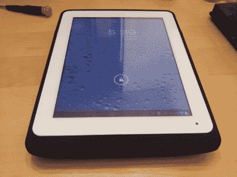

# iPad 外置电池盒被迫与非 IPad 平板电脑配合使用

> 原文：<https://hackaday.com/2012/10/02/ipad-external-battery-case-forced-to-work-with-a-non-ipad-tablet/>

[食肉动物]使用 Pipo Max M1 平板电脑。得益于 1.6 GHz 双核处理器和运行 Jellybean(最新版本的 Android 操作系统)，这是一款反应非常灵敏的 Android 设备。他唯一不满意的是电池寿命。在重负荷下，它可以持续大约三个小时。阅读电子书时，使用时间可延长至 10 小时。他的解决方案是增加一个外部电池。事实证明，9.7 英寸的屏幕使该设备的机身几乎与 iPad 完全相同，所以他为 iPad 制作了一个外部电池盒，可与 Android 平板电脑配合使用。

[食肉动物]首先拆除了一个装有 6000 毫安时电池的 iP6000 外壳。他移除了基座连接器，并安装了一个 2.5 毫米的电源插孔。幸运的是，Android 平板电脑上的按钮几乎和 iPad 上的按钮在同一个位置，电源按钮孔只需要扩大一点。这款保护套使用 microUSB 端口为自身和平板电脑的内部电池充电，这意味着他不再需要随身携带一根特殊的电源线。新硬件将电池寿命延长了约 75%。